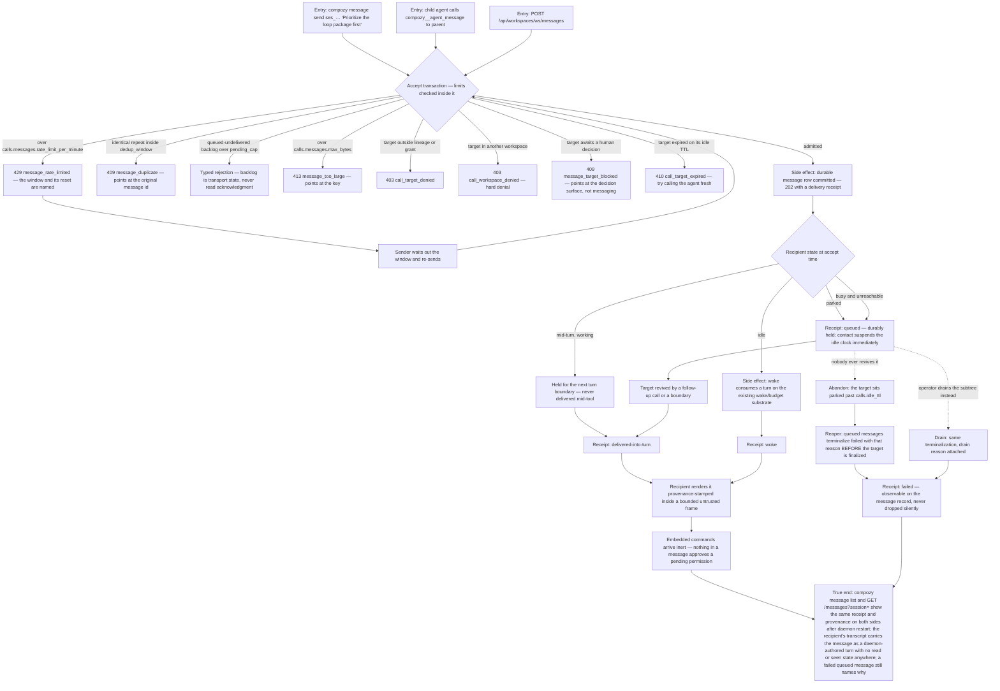

# J-message-a-running-agent — Say something to work already in flight

Delegation is not the only thing people need. Sometimes the work is already running and someone —
an operator, or the child itself talking back to its parent — needs to say one thing: *prioritize
this first*, *blocked, proceed anyway?*. The mailbox is that channel: text, bounded, durable-first,
and **inert**. A message never approves a permission, never runs a command, and never interrupts a
tool mid-flight; it lands at a turn boundary, or wakes an idle recipient into a new turn, or waits
durably in the queue until the recipient is reachable.

There is deliberately **no read or seen state**. The observable is the delivery receipt —
`delivered-into-turn`, `woke`, `queued`, or `failed` — and a queued message is never silently
dropped: when its target expires on the idle clock or is drained, the message terminalizes `failed`
with that reason, on the record.

Covers ADR-003 (parked children and the TTL ceiling), ADR-004 (durable delivery always; waking an
idle recipient consumes a turn on the existing wake/budget substrate), and safety invariants 11
(the idle reaper never touches a session with an open call) and 13 (rate-limit, dedup-window and
pending-cap checks run inside the accept transaction with typed, observable rejections).



```yaml
journey:
  id: J-message-a-running-agent
  name: "Message an agent that is already working"
  value_statement: "I can say one thing to work already in flight — and know whether it landed, woke someone, is waiting, or failed — without it ever being able to act on my behalf."
  personas: [Bruno, Ada]
  entry_points:
    - url: "CLI: compozy message send <session-id> <text>; compozy message list [--session] [--limit] [-o human|json|jsonl|toon]"
      origin: direct
    - url: "HTTP/UDS: POST /api/workspaces/{workspace_id}/messages with to.session_id and text; GET /api/workspaces/{workspace_id}/messages?session={session_id}&limit=2"
      origin: direct
    - url: "native: compozy__agent_message (to: parent | a session id inside the lineage or grant)"
      origin: direct
    - url: "CLI: compozy config get/set calls.messages.rate_limit_per_minute | dedup_window | pending_cap | max_bytes"
      origin: direct
  actions:
    - step: 1
      verb: "Send one message to a child that is actively working"
      expected_observable: "202 with a durable message id; the receipt is delivered-into-turn and the text lands at the next turn boundary — never in the middle of a tool call"
    - step: 2
      verb: "Send to an idle recipient and to a parked one"
      expected_observable: "The idle recipient's receipt is woke and the wake consumes a turn on the existing budget substrate; the parked recipient's receipt is queued, held durably, and contact suspends its idle clock immediately"
    - step: 3
      verb: "Push each limit in turn — rate, dedup window, pending cap, byte size"
      expected_observable: "Every rejection is typed and observable and happens inside the accept transaction: message_rate_limited names the window and reset, message_duplicate points at the original id, the pending cap counts queued-undelivered transport backlog only, message_too_large points at calls.messages.max_bytes"
    - step: 4
      verb: "Let a queued message's target expire on the idle clock, and drain another"
      expected_observable: "Queued messages terminalize failed with the expiry or drain reason before the target is finalized — the failure is on the message record, never a silent drop, and there is no extra retry knob"
    - step: 5
      verb: "Read a delivered message as its recipient, with an embedded command in the body"
      expected_observable: "It renders provenance-stamped ('from agent reviewer (ses_…), not the operator') inside a bounded untrusted frame; the embedded command is inert and cannot approve a pending permission"
    - step: 6
      verb: "List messages from CLI, HTTP, UDS and the native surface"
      expected_observable: "All four agree on receipt, provenance and order; no surface renders a message total, a read state, or a seen state, because none exists"
  goal:
    observable: "The message reached its recipient with a truthful receipt, and the recipient could read it but never act on it"
    side_effects: [durable-message-row, turn-boundary-delivery, wake-consuming-a-turn, idle-clock-suspended-on-contact, queued-message-terminalized-on-expiry-or-drain]
  true_end_state: "After daemon restart: message list on CLI, HTTP, UDS and the native tool show the same receipt, provenance and durable order for both the operator-sent and the agent-sent message; a message that failed on expiry still names its reason; profile and workspace isolation hold on every read; nothing anywhere renders read, seen, or a message count."
  exit:
    natural: "The recipient picks the message up on its next turn and adjusts what it is doing."
  abandonment:
    - at_step: 4
      how: "The sender queues a message for a parked child and nobody ever revives it."
      resume: "The idle TTL reaper terminalizes the queued message failed with the expiry reason before finalizing the target, so the sender's next list read shows why it never landed rather than an eternally queued row. The reaper never touches a session with an open call, so a working child is never clock-reaped out from under a queued message."
    - at_step: 2
      how: "The sender closes the CLI immediately after send and never checks the receipt."
      resume: "Delivery is durable-first and independent of the sender's session: the receipt is on the message record and re-readable from any surface later."
  crosses: [calls-mailbox, session-boundary-delivery, wake-and-budget-substrate, idle-ttl-reaper, synthetic-prompt-seam, GlobalDB, CLI, HTTP, UDS, native-tools]
```
