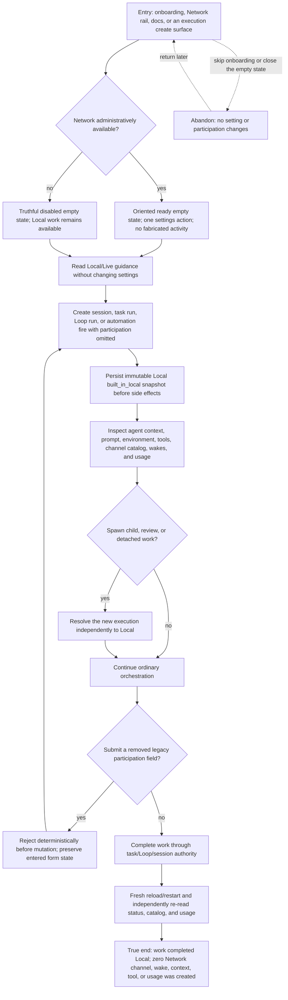

# Keep ordinary work Local while discovering the Network

A solo builder encounters the Agent Network without being enrolled, starts ordinary work through each owner surface, and confirms that Local truly means no Network artifacts or activation. The value is confidence: AGH can advertise and explain the Network while normal sessions, tasks, Loops, automations, children, reviews, and detached work remain independent and cost nothing on that plane.



```yaml
journey:
  id: J-network-local-default
  name: "Keep ordinary work Local while discovering the Network"
  value_statement: "A builder can learn that the Agent Network exists and complete ordinary work without hidden enrollment, context cost, model activation, or orchestration dependency."
  personas: [Nia, Ada, Bruno]
  entry_points:
    - url: "web onboarding, /network, /settings/network, session/task/Loop/automation create and start surfaces"
      origin: in-app-nav
    - url: "HTTP/UDS/CLI/native session, task, Loop, and automation create/start verbs"
      origin: direct
    - url: "public Network runtime guides and bundled AGH skill"
      origin: search
  actions:
    - step: 1
      verb: "Discover the Network without enabling it"
      expected_observable: "Ready and disabled empty states explain Local/Live and offer a settings path, while onboarding and docs mutate nothing and fabricate no peers or activity"
    - step: 2
      verb: "Start each ordinary execution owner with participation omitted"
      expected_observable: "Each owner persists one immutable Local/built_in_local snapshot and continues through its normal task, session, Loop, or automation lifecycle"
    - step: 3
      verb: "Inspect the execution and Network surfaces"
      expected_observable: "Local agent context has no Network prompt, environment, membership, or coordination tools; channel/wake/usage reads remain unchanged at zero for the execution"
    - step: 4
      verb: "Create derivative work and try a removed input"
      expected_observable: "Children, reviews, and detached work resolve independently to Local; legacy fields fail before mutation with a named deterministic error"
  goal:
    observable: "Every ordinary owner completes under Local semantics, and independent structured reads prove no Network artifact or usage was created"
    side_effects: [local-snapshot-persisted, ordinary-work-completed]
  true_end_state: "After a fresh reload and daemon restart, owner projections still read Local, task/Loop/session outcomes remain correct, Network catalogs and usage contain no artifacts from the Local executions, and onboarding/settings remain unchanged unless explicitly edited."
  exit:
    natural: "The builder continues ordinary work or deliberately chooses a separate explicit Live journey later."
  abandonment:
    - at_step: 1
      how: "The builder dismisses onboarding or closes the Network empty state."
      resume: "Returning later shows the same truthful empty state and no participation or settings side effect."
  crosses: [onboarding, public-docs, official-skill, session-owner, task-owner, loop-owner, automation-owner, agent-context, native-tools, network-projections, usage]
```
