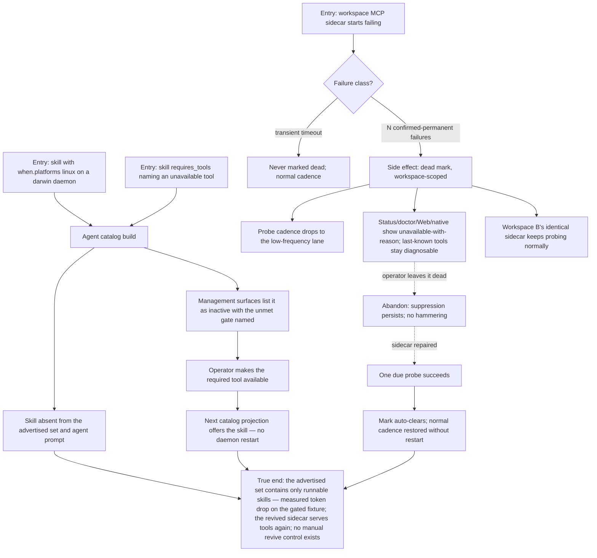

# J-offer-runnable-capabilities — Only runnable capabilities are offered; dead ones recover

A managed agent should only be offered skills whose `when.*` activation gates pass — with gated
skills truthfully listed as inactive-with-reason — and a dead extension/bridge/MCP sidecar should
stop being hammered, stay diagnosable, and auto-recover on success without a daemon restart.
Covers US-011 (ADR-009 §2 + ADR-010 §5, Safety Invariant 20).



```yaml
journey:
  id: J-offer-runnable-capabilities
  name: "Only runnable capabilities are offered; dead ones recover"
  value_statement: "An agent is never offered a skill it cannot run, an operator can always see why something is inactive, and a dead sidecar heals itself instead of being hammered."
  personas: [Ada, Dora]
  entry_points:
    - url: "SKILL.md metadata.agh.when; agent startup/current-turn catalogs"
      origin: direct
    - url: "CLI: agh skill list|inspect; agh status; agh doctor --only mcp"
      origin: direct
    - url: "HTTP/UDS: GET /api/skills; GET /api/settings/mcp-servers; web /skills and /mcp"
      origin: in-app-nav
  actions:
    - step: 1
      verb: "Build the catalog with an unmet platform/tool gate"
      expected_observable: "The skill is absent from the advertised set and agent prompt; list surfaces show inactive with the exact unmet gate; unknown when.* keys fail parsing"
    - step: 2
      verb: "Satisfy the gate"
      expected_observable: "The next catalog projection activates the skill without restarting AGH; administrative enabled state stayed independent throughout"
    - step: 3
      verb: "Drive a sidecar to confirmed-permanent failure"
      expected_observable: "Only the affected workspace marks it dead; probing drops to the low-frequency lane; tool availability shows unavailable-with-reason; transient timeouts never mark dead"
    - step: 4
      verb: "Repair the sidecar and wait for one due probe"
      expected_observable: "Success auto-clears the mark and restores normal cadence — no daemon restart, no manual revive control"
  goal:
    observable: "Advertised set = runnable set; dead entity suppressed then self-recovered"
    side_effects: [dead-entity-mark-clear-events, catalog-rebuild]
  true_end_state: "Fresh catalog, status, and doctor reads agree: gated skills inactive-with-reason, revived sidecar ready, workspace B never suppressed, and the measured advertised-token count dropped on the gated fixture."
  exit:
    natural: "The agent proceeds with a truthful capability set; the operator trusts diagnostics over restarts."
  abandonment:
    - at_step: 3
      how: "The operator sees the dead mark and walks away without repairing."
      resume: "Suppression persists at low frequency — no hammering, no noise; the entity recovers automatically whenever a later probe succeeds."
  crosses: [skills-registry, agent-prompt-assembly, mcp-host, dead-entity-registry, doctor, status, web-skills, workspace-isolation]
```
