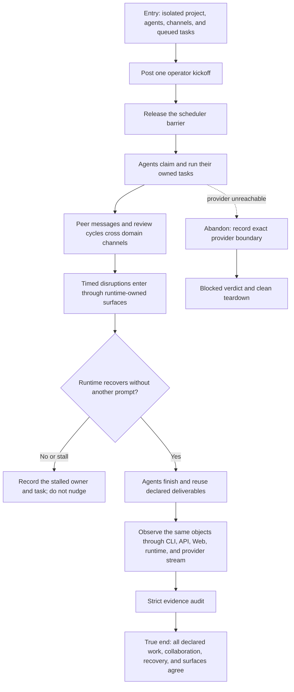

# J-one-kickoff-collaboration — Complete autonomous work after one operator kickoff

This journey observes a real multi-agent project after one in-persona operator kickoff. The operator
does not nudge stalled agents. The runtime must activate the declared task tree, retain provider-backed
progress, carry review and disagreement loops through channels, recover from planned disruptions, and
leave inspectable deliverables that agree across CLI, API, Web, runtime events, and workspace files.



```yaml
journey:
  id: J-one-kickoff-collaboration
  name: "Complete autonomous work after one operator kickoff"
  value_statement: "A real operator can start a declared team once and later inspect completed, reviewed, disruption-aware work without hidden follow-up prompting."
  personas: [Bruno]
  entry_points:
    - url: "real provider-backed operator session"
      origin: direct
    - url: "Task scheduler, Network channels, CLI/API/Web runtime views"
      origin: direct
  actions:
    - step: 1
      verb: "Post one in-persona project kickoff"
      expected_observable: "The provider stream records one non-empty kickoff and task dispatch releases only after that post is confirmed."
    - step: 2
      verb: "Observe agents execute the declared task tree"
      expected_observable: "Every seeded task gains one owned run and progress remains visible without another operator prompt."
    - step: 3
      verb: "Observe collaboration and recovery"
      expected_observable: "Required peer messages, reviews, disagreement resolution, and disruption responses are recorded on the declared channels."
    - step: 4
      verb: "Inspect deliverables and public projections"
      expected_observable: "Required artifacts parse or run, later work reuses them, and CLI, API, Web, runtime, and provider evidence identify the same project objects."
  goal:
    observable: "The declared project finishes with complete deliverables, collaboration, and disruption recovery after exactly one kickoff."
    side_effects: [task-runs, peer-messages, review-verdicts, workspace-deliverables, disruption-recovery]
  true_end_state: "All declared runs are terminal, required deliverables and collaboration satisfy the playbook contract, public surfaces agree, the strict audit passes, and no second operator prompt was sent."
  exit:
    natural: "The operator reads the terminal project state and the lab tears down with no surviving process."
  abandonment:
    - at_step: 2
      how: "A provider is unreachable or an agent becomes silent beyond the stall threshold."
      resume: "The run records a blocked or failed verdict with the exact owner/task and evidence; no prompt is injected to wake the agent."
  crosses: [provider-session, tasks, scheduler, network-channels, reviews, web, cli, api, runtime-observer]
```
