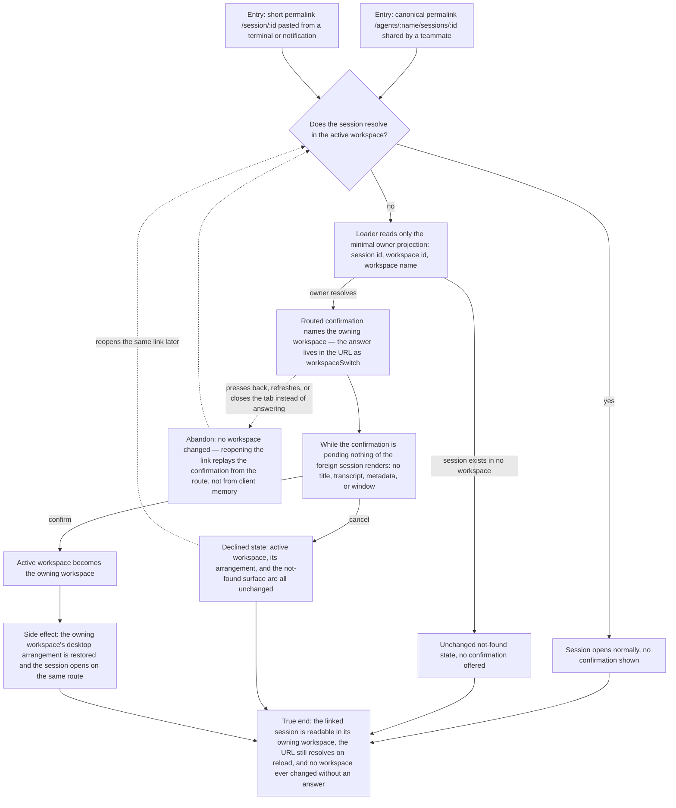

# J-open-foreign-session — Open a linked session that lives in another workspace

Someone shares a session link. The person who opens it may not have that session's workspace active,
and switching workspaces swaps desktops, windows, and runtime context — too heavy to happen behind
their back. So the link resolves who owns the session, shows nothing of the session itself, asks, and
only then switches. Cancelling costs nothing; a dead link still reads as dead.



```yaml
journey:
  id: J-open-foreign-session
  name: "Open a linked session that lives in another workspace"
  value_statement: "A session permalink works from anywhere — it explains whose workspace it belongs to and switches only when the person says yes."
  personas: [Nia, Théo]
  entry_points:
    - url: "web canonical deep link /agents/:name/sessions/:id"
      origin: external-share
    - url: "web short permalink /session/:id"
      origin: external-share
    - url: "web route search ?workspaceSwitch=confirm and ?workspaceSwitch=declined"
      origin: direct
    - url: "GET /api/sessions/:session_id/owner (the minimal owner projection behind the confirmation)"
      origin: direct
  actions:
    - step: 1
      verb: "Open a shared session link while a different workspace is active"
      expected_observable: "A confirmation names the owning workspace by its registered name and describes the switch as changing the active workspace and its open windows"
    - step: 2
      verb: "Look at the page behind the confirmation"
      expected_observable: "No title, transcript, metadata, or window from the foreign session is visible — only the owning workspace's identity was resolved"
    - step: 3
      verb: "Confirm the switch"
      expected_observable: "The active workspace becomes the owning one, its desktop arrangement is the one restored, and the session opens on the same route"
    - step: 4
      verb: "Cancel instead, on both the canonical and the short link"
      expected_observable: "The active workspace, its arrangement, and the existing not-found state are unchanged, and the declined state does not re-open the dialog on its own"
    - step: 5
      verb: "Open a session id that exists in no workspace"
      expected_observable: "Today's not-found surface, with no confirmation offered and no spinner left hanging"
    - step: 6
      verb: "Reload the URL carrying the confirmation state"
      expected_observable: "The confirmation replays from the route rather than resolving from stale client memory, and the owning workspace still comes from the owner lookup, never from a search parameter"
  goal:
    observable: "The shared link lands the reader on the session it points at, in the workspace that owns it, after one explicit answer"
    side_effects: [active-workspace-switched, owning-workspace-desktop-restored, session-owner-projection-cached-separately]
  true_end_state: "The session's transcript is readable in its owning workspace; reloading the same URL lands in the same place; cancelling or abandoning leaves the original workspace and its arrangement exactly as they were; and no foreign session data was ever rendered before the answer."
  exit:
    natural: "The reader is on the linked session's thread and reads or follows it (J-12, J-14)."
  abandonment:
    - at_step: 1
      how: "The confirmation appears and the reader presses back, refreshes, or closes the tab instead of answering."
      resume: "Nothing switched; reopening the link raises the confirmation again from the route state, and the original workspace's arrangement is untouched."
    - at_step: 4
      how: "The reader cancels, decides the link was not worth a context switch, and moves on."
      resume: "Returning to the same link later offers the confirmation again rather than remembering the refusal as a dead end."
  crosses: [web-route-loaders, session-owner-projection, active-workspace-store, os-desktop-arrangement, TanStack-Query-cache, HTTP-API]
```

Taxonomy note: journeys, functional checks, and edge/empty states are in scope, and the experiential
lens matters here — this is a first-impression surface for Nia, so a stalled or double-flashing open
is a finding even when the switch is correct. Responsiveness across viewports is not in scope: the
change is routing and dialog behavior, not layout. Regression rides `J-12` (open-session-fast) and
`J-11` (return-to-running-session), which own the non-foreign open and return paths.
