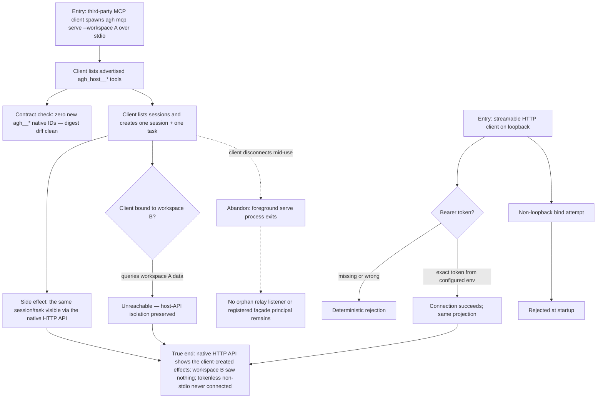

# J-operate-agh-from-mcp-client — Operate AGH from an unmodified MCP client

An agent operator drives one AGH workspace from a third-party MCP client: `agh mcp serve` re-projects
the existing workspace-bound Host API over stdio (or token-authenticated loopback HTTP), the client
lists sessions and creates a task whose effects are visible on the native HTTP API, and workspace
isolation plus the no-new-native-IDs contract hold. Covers US-010 (ADR-008).



```yaml
journey:
  id: J-operate-agh-from-mcp-client
  name: "Operate AGH from an unmodified MCP client"
  value_statement: "Any MCP-speaking tool becomes an AGH operator for exactly one workspace — with real effects, real isolation, and no bespoke integration."
  personas: [Ada]
  entry_points:
    - url: "CLI: agh mcp serve --workspace <id> (stdio spawn by the client)"
      origin: direct
    - url: "MCP streamable HTTP on loopback with bearer token"
      origin: direct
    - url: "native HTTP API (verification read path)"
      origin: direct
  actions:
    - step: 1
      verb: "Connect an unmodified MCP client over stdio and list tools"
      expected_observable: "The advertised set re-projects the Host API; the native agh__* registry digest is unchanged"
    - step: 2
      verb: "List sessions and create a task through the façade"
      expected_observable: "Both operations succeed with structured output; the created task and session appear via the native HTTP API"
    - step: 3
      verb: "Probe isolation from a workspace-B-bound relay"
      expected_observable: "Workspace A sessions/tasks are unreachable; the same not-found/denied shape as for nonexistent data"
    - step: 4
      verb: "Connect over loopback HTTP without, with wrong, and with the exact token"
      expected_observable: "Tokenless and wrong-token connections reject deterministically; the exact token connects; non-loopback startup is refused"
  goal:
    observable: "A third-party client operated AGH with effects visible natively"
    side_effects: [session-created, task-created]
  true_end_state: "Native HTTP reads confirm the client's effects; the digest diff is clean; stopping the serve process leaves no relay listener or façade principal behind."
  exit:
    natural: "The integrator wires AGH into their MCP-speaking tooling for the workspace."
  abandonment:
    - at_step: 2
      how: "The client disconnects mid-operation."
      resume: "The foreground serve process terminates cleanly; already-created sessions/tasks persist and are manageable through native surfaces; a fresh spawn reconnects."
  crosses: [mcp-facade, host-api, workspace-isolation, native-registry-digest, CLI, HTTP, SECURITY.md-authority-claims]
```

Taxonomy note: structured integration journey with no Web surface. Functional, auth-failure,
isolation, and cleanup checks in scope; responsive/visual accessibility not applicable.
