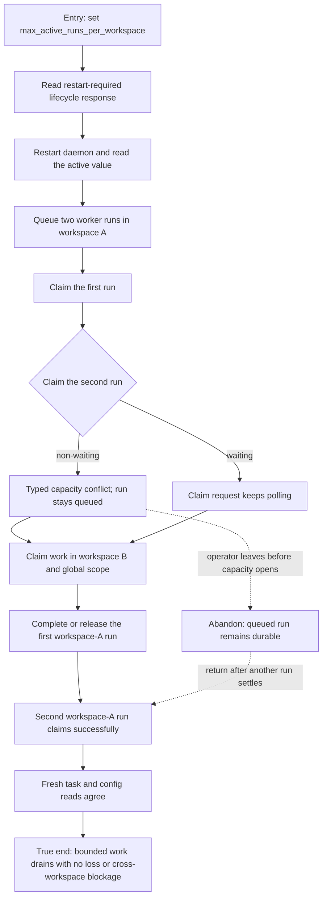

# J-operate-bounded-task-capacity — Operate work within workspace capacity

An operator sets a workspace execution bound, then an agent proves that excess work waits without
being lost and drains as soon as capacity opens. The journey crosses configuration lifecycle,
session-bound claims, durable queue state, and workspace isolation.



```yaml
journey:
  id: J-operate-bounded-task-capacity
  name: "Operate work within workspace capacity"
  value_statement: "Operators can bound concurrent workspace execution while agents keep excess work durable and make progress as capacity opens."
  personas: [Ada, Bruno]
  entry_points:
    - url: "CLI: agh config set task.orchestration.max_active_runs_per_workspace; agh task next --wait -o json"
      origin: direct
    - url: "HTTP/UDS: POST /api/agent/tasks/claim-next"
      origin: direct
    - url: "native tools: agh__config_set; agh__task_run_claim_next"
      origin: direct
  actions:
    - step: 1
      verb: "Set the workspace active-run bound"
      expected_observable: "The structured mutation reports restart-required lifecycle truth and the restarted daemon enforces the configured value."
    - step: 2
      verb: "Claim more workspace work than the bound permits"
      expected_observable: "One run owns the available slot; a non-waiting claim returns the typed capacity conflict and a waiting claim continues polling while the second run stays queued."
    - step: 3
      verb: "Check isolation and control-plane exemptions"
      expected_observable: "Workspace B, global task runs, and Network wake runs remain claimable while workspace A is full."
    - step: 4
      verb: "Open capacity and continue the queued run"
      expected_observable: "Completing, releasing, or expiring the active lease lets the deferred run claim without re-enqueueing or changing its attempt."
  goal:
    observable: "Fresh config and task reads show the configured bound, one active workspace-A run, and eventual claim of the preserved queued run."
    side_effects: [desired-config-written, daemon-generation-restarted, task-run-preserved-and-claimed]
  true_end_state: "The deferred run leaves the durable queue only after workspace capacity opens; another workspace plus global and Network wake work were never blocked."
  exit:
    natural: "The operator leaves the configured bound in place and agents continue processing the backlog within it."
  abandonment:
    - at_step: 2
      how: "The operator closes the client while the second run is waiting for capacity."
      resume: "The run remains queued in GlobalDB and can be claimed after the active lease settles, even by a new waiting client."
  crosses: [config-lifecycle, task-service, GlobalDB, CLI, HTTP, UDS, native-tools, workspace-isolation]
```

Taxonomy note: functional, failure/retry, abandonment/resume, concurrency, durability, and
cross-surface consistency are in scope. No Web control was added, so responsive and visual checks
are not applicable to this journey.
