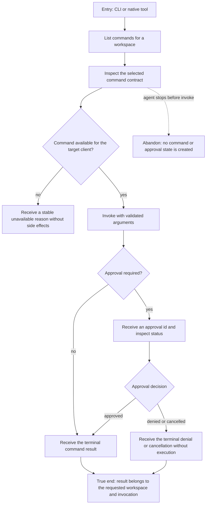

# J-operate-command-palette — Operate commands through structured surfaces

An autonomous agent discovers a command, verifies its contract, invokes it in the intended
workspace and client context, and observes any approval through deterministic structured output.



```yaml
journey:
  id: J-operate-command-palette
  name: "Operate commands through structured surfaces"
  value_statement: "An agent can discover and invoke an available command safely without relying on the web UI."
  personas: [Ada]
  entry_points:
    - url: "compozy cmd-palette list|inspect|invoke"
      origin: direct
    - url: "compozy__cmd_palette_list|invoke"
      origin: direct
  actions:
    - step: 1
      verb: "List commands in the intended workspace and client context"
      expected_observable: "Structured output contains the canonical command ids and current availability"
    - step: 2
      verb: "Inspect one command before invoking it"
      expected_observable: "The action, argument schema, execution policy, and availability match the listed command"
    - step: 3
      verb: "Invoke with valid arguments and follow any approval"
      expected_observable: "The response carries stable invocation and approval ids until a terminal result"
  goal:
    observable: "The terminal result or denial is correlated to the requested invocation with no duplicate execution"
    side_effects: [command-executed, approval-recorded]
  true_end_state: "A fresh approval-status read agrees with the terminal result and the command affected only the requested workspace."
  exit:
    natural: "The agent continues with the structured result or a stable terminal reason"
  abandonment:
    - at_step: 2
      how: "The agent stops after inspection"
      resume: "A later list starts from current catalog state without a pending invocation"
  crosses: [cmdpalette, tools, windowmanager, HTTP, UDS, CLI, native-tools]
```
