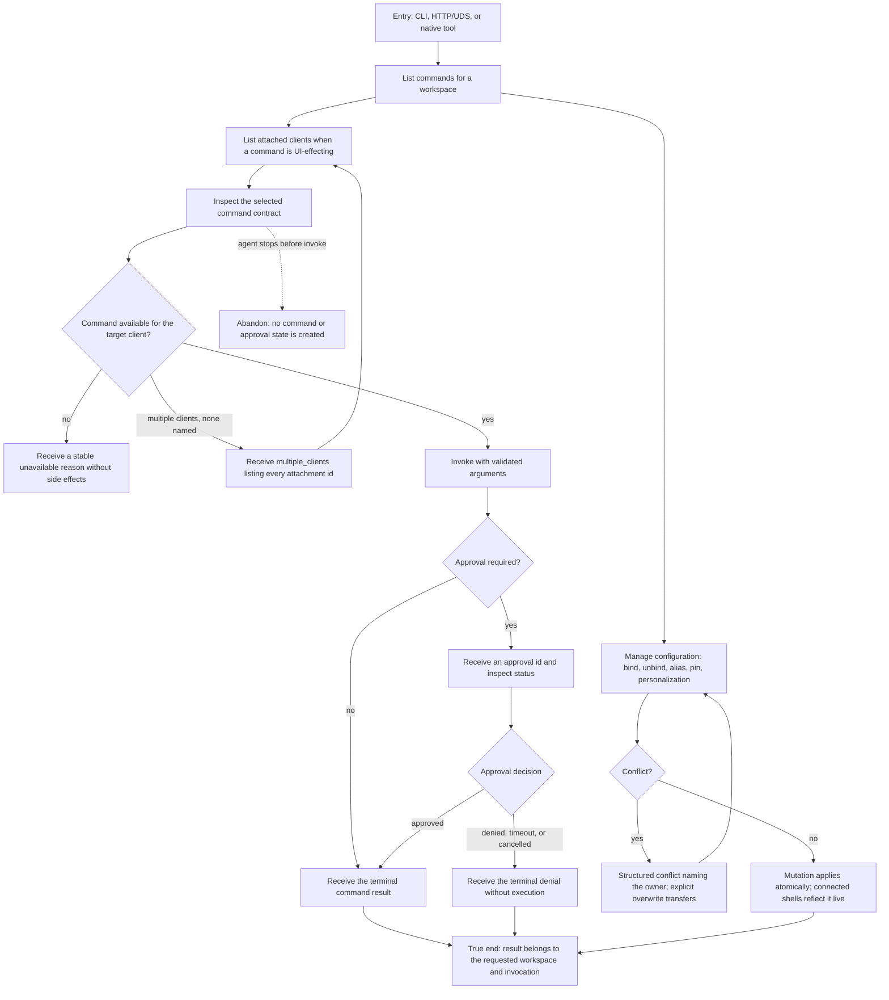

# J-operate-command-palette — Operate commands through structured surfaces

An autonomous agent discovers a command, verifies its contract, targets the right attached client,
invokes it in the intended workspace, observes any approval through deterministic structured
output, and manages palette configuration — bindings, aliases, pins, personalization — through the
same validated daemon paths the Settings UI uses.



```yaml
journey:
  id: J-operate-command-palette
  name: "Operate commands through structured surfaces"
  value_statement: "An agent can discover, invoke, and configure every palette command safely without relying on the web UI."
  personas: [Ada]
  entry_points:
    - url: "compozy cmd-palette list|inspect|invoke|clients"
      origin: direct
    - url: "compozy cmd-palette bind|unbind|alias set|alias clear|bindings|pin|unpin|personalization show|personalization reset"
      origin: direct
    - url: "compozy approvals show|cancel"
      origin: direct
    - url: "compozy__cmd_palette_list|invoke (native tools)"
      origin: direct
    - url: "GET/POST /api/cmd-palette/* and GET|PATCH /api/settings/{cmd-palette,window-manager} (HTTP + UDS)"
      origin: direct
    - url: "GET /api/tools/approvals/{id}; POST /api/tools/approvals/{id}/cancel"
      origin: direct
  actions:
    - step: 1
      verb: "List commands in the intended workspace and client context"
      expected_observable: "Structured output contains the canonical command ids and current availability; without a named client, client-context commands report 'requires an attached shell'"
    - step: 2
      verb: "Inspect one command before invoking it"
      expected_observable: "The action, argument schema, execution policy, destructive flag, and availability match the listed command"
    - step: 3
      verb: "Target a client and invoke with valid arguments, following any approval"
      expected_observable: "Exactly one attachment auto-selects; several demand an explicit client with multiple_clients listing ids; the response carries stable invocation and approval ids until a terminal result"
    - step: 4
      verb: "Mutate bindings, aliases, pins, or reset personalization"
      expected_observable: "Conflicts name the owning command and move only with explicit overwrite; grammar violations return the same rule text the Settings UI shows; applied changes reach connected shells without restart"
  goal:
    observable: "The terminal result or denial is correlated to the requested invocation with no duplicate execution, and every configuration mutation lands atomically in the requested workspace"
    side_effects: [command-executed, approval-recorded, keymap-or-alias-changed, personalization-changed]
  true_end_state: "A fresh approval-status read agrees with the terminal result, a fresh list shows the mutated bindings/aliases/pins, and the command affected only the requested workspace."
  exit:
    natural: "The agent continues with the structured result or a stable terminal reason"
  abandonment:
    - at_step: 2
      how: "The agent stops after inspection"
      resume: "A later list starts from current catalog state without a pending invocation"
    - at_step: 3
      how: "The agent cancels a pending approval"
      resume: "The approval reaches terminal canceled; the single-flight guard releases and a fresh invoke proceeds"
  crosses: [cmdpalette, tools, windowmanager, settings, HTTP, UDS, CLI, native-tools]
```

## Coverage notes

- Derived scenarios: `ET-agent-command-invoke` (discover → target → invoke → approval) and
  `ET-agent-palette-config-parity` (bind/unbind/alias/bindings/pin/unpin/personalization parity).
- The operator-side mirror is `J-command-os-from-palette`.
