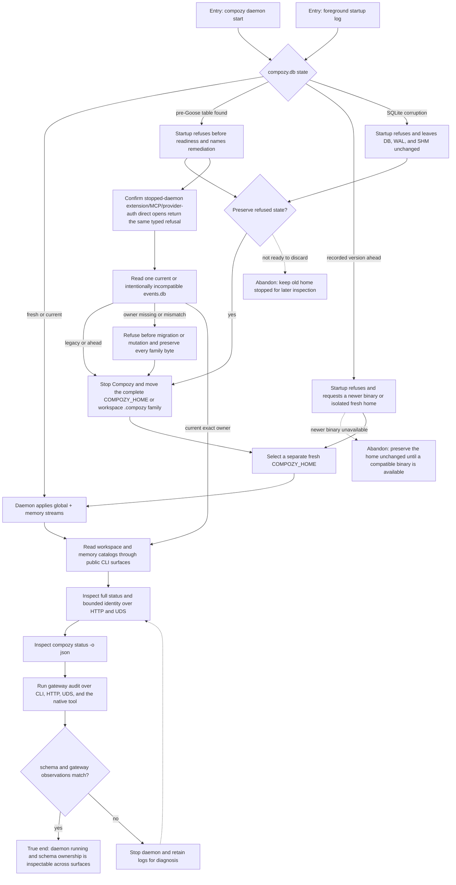

# J-operate-daemon-schema — Start and inspect the daemon schema safely

An operator starts Compozy from a fresh home or a retained alpha home, follows deterministic migration
remediation, and confirms the daemon's physical schema streams through structured surfaces.



```yaml
journey:
  id: J-operate-daemon-schema
  name: "Start and inspect the daemon schema safely"
  value_statement: "An operator can start Compozy without silently rewriting incompatible or corrupt state and can inspect the exact daemon-global schema versions through agent-manageable surfaces."
  personas: [Bruno, Ada, Dora]
  entry_points:
    - url: "CLI: compozy daemon start"
      origin: direct
    - url: "CLI: compozy daemon start --foreground"
      origin: direct
    - url: "HTTP/UDS: GET /api/status"
      origin: direct
    - url: "HTTP/UDS: GET /api/status/identity"
      origin: direct
    - url: "CLI: compozy status -o json"
      origin: direct
    - url: "CLI: compozy gateway audit -o json; HTTP/UDS: GET /api/gateway/audit; native tool: compozy__gateway action=audit"
      origin: direct
    - url: "CLI: compozy extension list -o json; compozy mcp auth status -o json; compozy provider auth status <bound-secret-provider> -o json"
      origin: direct
    - url: "CLI: compozy workspace list -o json; compozy memory list -o json"
      origin: direct
    - url: "CLI: compozy session events <session-id>; compozy session history <session-id>"
      origin: direct
  actions:
    - step: 1
      verb: "Start the daemon against the selected COMPOZY_HOME"
      expected_observable: "A current database reaches readiness; a pre-Goose or corrupt database is refused before mutation with its path."
    - step: 2
      verb: "Stop Compozy, preserve or move the complete incompatible COMPOZY_HOME or workspace .compozy family, and select a separate fresh home"
      expected_observable: "Every sibling database remains together for investigation and the separately selected fresh daemon home reaches readiness."
    - step: 3
      verb: "Read preserved session events or materialize a terminal ledger"
      expected_observable: "Legacy, ahead, corrupt, ownerless, and foreign-owned events.db files are refused before migration or mutation while an exactly owned session database remains readable."
    - step: 4
      verb: "Exercise global and memory read paths after migration and restart"
      expected_observable: "Workspace and memory catalog reads succeed while the two version streams remain independently visible."
    - step: 5
      verb: "Compare full status and bounded runtime identity over HTTP, UDS, and CLI JSON"
      expected_observable: "Full status keeps the same ordered global and memory entries; repeated identity reads return only the process and listener identity on both transports."
    - step: 6
      verb: "Run the gateway self-audit through each structured surface"
      expected_observable: "Every surface returns the same stable, severity-ranked findings or an explicit no-findings result without changing gateway state or exposing credentials."
  goal:
    observable: "The daemon is running on a supported schema and reports schema and gateway posture consistently across structured surfaces."
    side_effects: [fresh-database-created, migration-streams-applied, status-contract-published]
  true_end_state: "After fresh status and gateway-audit reads, HTTP, UDS, CLI, and the native tool agree on schema and gateway posture without changing runtime state; any refused COMPOZY_HOME, workspace .compozy, or session database family is preserved and was never modified."
  exit:
    natural: "The operator continues normal Compozy work with a running, inspectable daemon."
  abandonment:
    - at_step: 2
      how: "The operator is not ready to discard or archive the incompatible alpha state."
      resume: "Keep that COMPOZY_HOME stopped, preserve the refusal log, and return after choosing a separate fresh home or an older matching binary for inspection."
    - at_step: 1
      how: "The database was written by a newer post-squash binary and the matching binary is unavailable."
      resume: "Leave the home unchanged and resume only with a compatible newer binary or a separately selected fresh COMPOZY_HOME."
  crosses: [daemon-boot, desktop-liveness, session-readers, ledger-materialization, SQLite, Goose, HTTP, UDS, CLI]
```

Taxonomy note: this journey covers the functional happy path, global and per-session legacy/ahead/corruption error and
recovery paths, shared-file domain smoke, structured-surface consistency, deterministic gateway findings, secret
containment, and operational recoverability. UI
responsiveness, mobile continuity, and screen-reader coverage are deliberately skipped because the program adds
no rendered UI.
