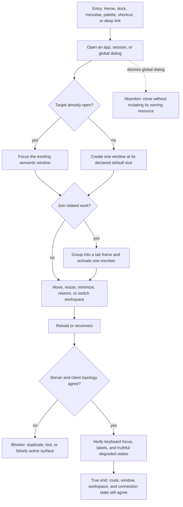

# J-operate-desktop-shell — Operate Compozy through one coherent desktop shell

An operator moves among apps, sessions, global dialogs, and window topology without losing route,
workspace, or connection truth. Dock, menubar, command palette, shortcuts, and URLs are alternate
entry points into the same semantic desktop state.



```yaml
journey:
  id: J-operate-desktop-shell
  name: "Operate Compozy through one coherent desktop shell"
  value_statement: "I can reach and arrange my work from any shell entry point without duplicate windows, lost context, or invented state."
  personas: [Bruno, Sol]
  entry_points:
    - url: "web / via dock, menubar, command palette, or keyboard shortcut"
      origin: in-app-nav
    - url: "web deep link to an app or session route"
      origin: direct
  actions:
    - step: 1
      verb: "Open the same app through multiple shell entry points"
      expected_observable: "One semantic window is created or focused, with the declared route and default size"
    - step: 2
      verb: "Open and dismiss global Sessions, Shortcuts, and About surfaces"
      expected_observable: "Dialog ownership, keyboard focus, and dismissal remain consistent"
    - step: 3
      verb: "Group related windows into tabs, arrange frames, and switch workspace or connection state"
      expected_observable: "Client-local active tabs and focus remain independent over shared topology; degraded states explain what is unavailable"
    - step: 4
      verb: "Reload and continue from the restored shell"
      expected_observable: "URL, active workspace, and visible windows converge without duplicates or lost routes"
  goal:
    observable: "Every shell entry point resolves to the same reachable work and survives reload with accessible focus and truthful state"
    side_effects: [window-opened-or-focused, shell-preferences-persisted]
  true_end_state: "A fresh load restores the intended desktop, route, and active workspace; keyboard navigation reaches every actionable control."
  exit:
    natural: "The operator continues work in the restored target window."
  abandonment:
    - at_step: 2
      how: "Dismiss a global modal or leave during a disconnected state."
      resume: "Reopen from another shell entry point; no resource mutation or duplicate window remains."
  crosses: [web-router, window-manager, tab-deck, dock, menubar, command-palette, session-catalog, accessibility, connection-state]
```
