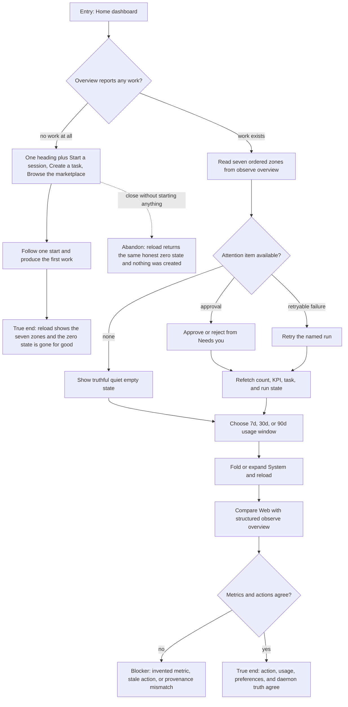

# J-operate-home-dashboard — Act from one truthful operational overview

A non-technical owner opens Home to understand what needs attention, what is running, what finished,
and what usage was incurred. They act on one approval and change the usage window without leaving
the overview or losing their display preferences.



```yaml
journey:
  id: J-operate-home-dashboard
  name: "Act from one truthful operational overview"
  value_statement: "I can understand and unblock agent work from Home without reading logs or trusting invented metrics."
  personas: [Cora]
  entry_points:
    - url: "web / Home window"
      origin: in-app-nav
    - url: "GET /api/observe/overview over HTTP or UDS"
      origin: direct
  actions:
    - step: 0
      verb: "Open Home on a workspace where nothing has run yet"
      expected_observable: "The seven zones give way to one heading and the three starts that actually exist; no zero-filled panels and no explainer paragraph"
    - step: 1
      verb: "Read each Home zone in order"
      expected_observable: "Attention, work, outcomes, usage, agents, activity, and system state render from persisted daemon data with truthful empty states"
    - step: 2
      verb: "Approve, reject, or retry one eligible attention item"
      expected_observable: "Only daemon-advertised actions render, and counts plus downstream state update after settlement"
    - step: 3
      verb: "Change the usage window and inspect provenance"
      expected_observable: "The selected window refetches bounded data; truncation and unknown or mixed cost provenance are explicit"
    - step: 4
      verb: "Fold System, reload, and compare structured output"
      expected_observable: "Preferences persist and the Web projection matches observe-overview/v1"
  goal:
    observable: "The owner can act once, explain the result, and trust every displayed number and empty state"
    side_effects: [attention-action-settled, home-preferences-persisted, overview-refetched]
  true_end_state: "After reload, the attention action remains settled, usage and System preferences remain selected, and structured overview data matches the rendered zones. On a workspace that started at zero, the first real start replaces the zero state with the seven zones and it never returns while work exists."
  exit:
    natural: "The owner starts a new session or leaves Home with no unresolved stale action."
  abandonment:
    - at_step: 0
      how: "Read the zero state, take none of the three starts, and close the window."
      resume: "Return to Home; the same honest zero state renders and nothing was created by looking."
    - at_step: 2
      how: "Leave while an attention action is settling."
      resume: "Return to Home; the daemon-owned result, not optimistic UI, determines the row and count."
  crosses: [observe-overview, tasks, runs, usage-ledger, web-dashboard, local-preferences, zero-inventory-first-run, session-create, marketplace, HTTP, UDS]
```
