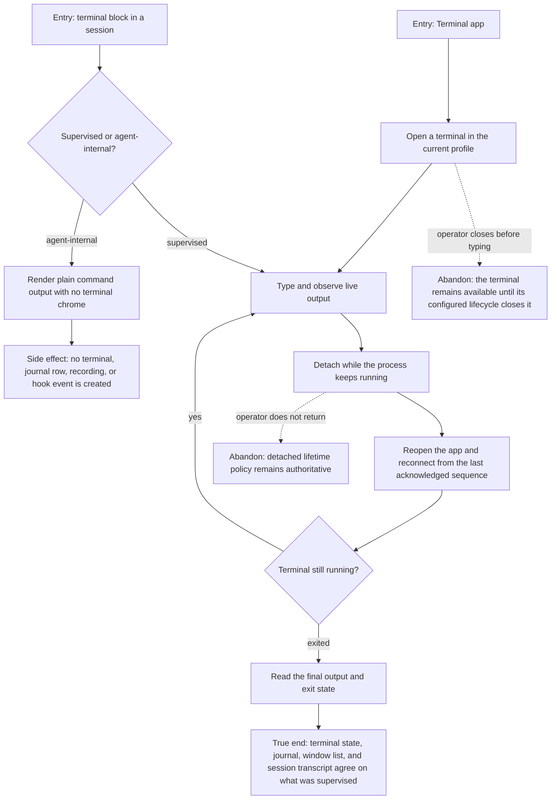

# J-operate-integrated-terminal — Work in a supervised terminal and keep agent reports distinct

An operator opens a real terminal, works in it, leaves and returns without losing the process, and
can always tell that supervised runtime activity apart from command output an agent ran internally
agent.



```yaml
journey:
  id: J-operate-integrated-terminal
  name: "Work in a supervised terminal and keep agent reports distinct"
  value_statement: "I can leave and return to terminal work without losing it, and I never mistake an agent's internal command output for a terminal I can control."
  personas: [Marina, Ada]
  entry_points:
    - url: "Terminal app and terminal blocks in a session transcript"
      origin: in-app-nav
    - url: "Agent-internal command output in the transcript"
      origin: agent
  actions:
    - step: 1
      verb: "Open a terminal in the current profile"
      expected_observable: "The window names the owning profile and becomes writable only after the stream is attached."
    - step: 2
      verb: "Run work, detach, and return"
      expected_observable: "Output resumes without duplicated or missing acknowledged bytes and the process keeps its identity."
    - step: 3
      verb: "Inspect agent-internal command output"
      expected_observable: "It renders as plain command output with no terminal chrome and creates no supervised terminal state."
    - step: 4
      verb: "Let the terminal exit and re-read its state"
      expected_observable: "The final output, exit reason, journal, and retained window state agree after a fresh load."
  goal:
    observable: "Supervised terminals remain resumable and agent reports remain inert across the session transcript, Terminal app, journal, and window catalog."
    side_effects: [terminal-created, stream-attached, journal-written, terminal-exit-retained]
  true_end_state: "A fresh read shows one coherent supervised lifecycle, while agent-internal command output appears solely in the conversation and leaves terminal storage empty."
  exit:
    natural: "The operator closes the finished terminal or continues work in the resumed one."
  abandonment:
    - at_step: 2
      how: "Close the window while the command is still running."
      resume: "Reopen the Terminal app and attach to the same terminal from the current stream cursor."
  crosses: [terminal-runtime, session-transcript, journal, recordings, profile-scope, WebSocket-stream]
```
