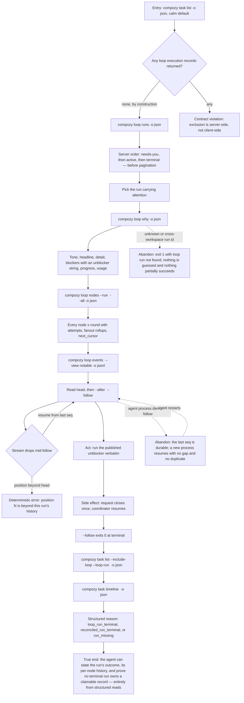

# J-operate-loop-run-headless — Read and settle a Loop run with no screen

An autonomous agent operates the same run an operator would, with no browser and no human at the
screen. It lists tasks and gets only real work back, finds the run that needs attention, asks why,
reads the full node roster, follows events with a resume position it owns, acts through the
published unblocker, and finally proves settlement by listing records again. Every step is
structured output, and every failure is a deterministic exit code with a fixed message.



```yaml
journey:
  id: J-operate-loop-run-headless
  name: "Read and settle a Loop run with no screen"
  value_statement: "An agent can operate a Loop run end to end through structured output alone, and can prove what happened without a browser or a human."
  personas: [Ada]
  entry_points:
    - url: "CLI: compozy task list --include-loop --loop-run <run-id> --parent <task-id> -o json"
      origin: direct
    - url: "CLI: compozy loop runs -o json | compozy loop why <run-id> | compozy loop nodes --run <run-id> --all | compozy loop events <run-id> --after <seq> --follow"
      origin: direct
    - url: "CLI: compozy task timeline <task-id> -o json"
      origin: direct
    - url: "HTTP/UDS GET /api/tasks, /api/tasks/:id, /api/workspaces/:workspace_id/loop-runs and its nodes, briefing, timeline routes"
      origin: direct
    - url: "native tool compozy__task_list"
      origin: direct
    - url: "skills/compozy/references/tasks-and-orchestration.md and references/loops.md"
      origin: direct
  actions:
    - step: 1
      verb: "List tasks with no flags"
      expected_observable: "Only real work comes back on CLI, HTTP, UDS and the native tool alike; facets and counts compute over the same filtered set"
    - step: 2
      verb: "Reveal loop records with the typed flags"
      expected_observable: "include_loop and loop_run_id return the same records with a structured loop provenance object; a non-boolean include_loop is a field-addressed 400"
    - step: 3
      verb: "List the runs and pick the one that needs a human"
      expected_observable: "Items carry progress always and attention only when something waits; ordering is needs-you then active then terminal, applied before pagination"
    - step: 4
      verb: "Ask why the run is where it is"
      expected_observable: "A non-empty verdict every time, with the cascade honoured, and a blocker carrying an unblocker command that runs verbatim"
    - step: 5
      verb: "Read the full node roster and follow events with resume"
      expected_observable: "Every node across rounds including healthy ones; --after is a per-run sequence, resume produces no gap and no duplicate, and a position beyond head fails deterministically"
    - step: 6
      verb: "Verify terminal settlement by listing records again"
      expected_observable: "No terminal run owns a claimable execution record, and each settled record's timeline names loop_run_terminal, reconciled_run_terminal or run_missing"
  goal:
    observable: "The agent holds a complete, structured account of the run — state, per-node history, cost, outcome — and independent reads agree."
    side_effects: [request-closed-once, coordinator-resumed, claim-eligibility-removed, timeline-reason-appended]
  true_end_state: "A fresh set of structured reads from a second transport reports the same run state, node roster and settlement reasons as the first, with no live record owned by an ended run."
  exit:
    natural: "The agent reports the outcome to whoever asked and needs no follow-up human read."
  abandonment:
    - at_step: 5
      how: "The agent process dies while following events."
      resume: "A new process resumes from the last durable sequence with no gap and no duplicate entry."
    - at_step: 4
      how: "The agent asks about a run id from another workspace."
      resume: "It gets a deterministic not-found and no partial state; nothing leaks across the workspace boundary."
  crosses: [task-catalog, loop-read-projections, timeline-paging, settlement-sweep, native-tools, official-skill, generated-cli-reference, CLI, HTTP, UDS, SSE]
```

Taxonomy note: journeys, functional, and edge/error dimensions carry this one — the value is
entirely in whether the structured contract holds, so the deterministic error rows (unknown run,
invalid state value, --state without --run, foreign cursor, beyond-head position, non-boolean
include_loop, cross-workspace id) are first-class scenarios, not afterthoughts. Cross-cutting:
semantic parity across CLI, HTTP, UDS and the native tool over the same persisted state, workspace
isolation on every new read, and documentation truth — the official skill's task-listing and loops
references plus the generated CLI/API pages are entry points on this journey, because an agent that
reads a wrong flag from the docs is as broken as a wrong response. Experiential, responsive and
accessibility are recorded skips: there is no human surface in this journey.
