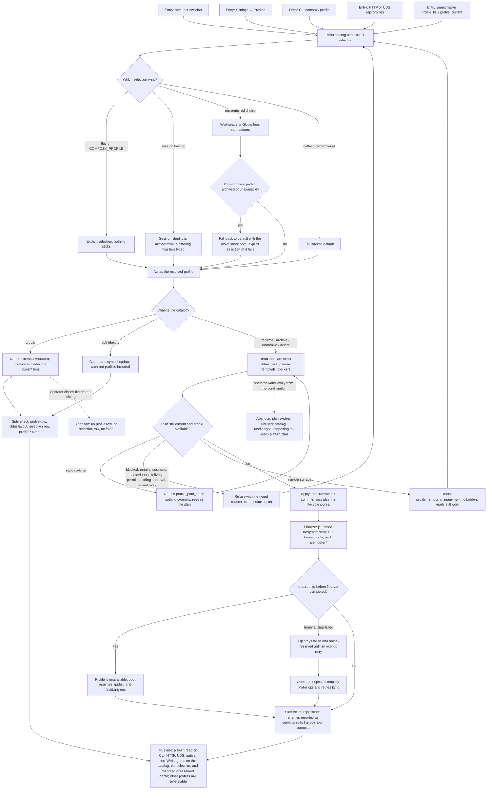

# J-operate-profiles — Name a working context and keep its lifecycle honest

An operator gives a working context a name, an identity, and a remembered place, then changes that
context over time — rename, archive, unarchive, delete — through previews that state exactly what
will happen. Every mutation is planned before it is applied, survives a crash, and refuses rather
than half-finishes. Scoped reading, palette projection, layers, extensions, per-profile state, and
the Global view are sibling journeys; this one owns identity, selection, and lifecycle.



```yaml
journey:
  id: J-operate-profiles
  name: "Name a working context and keep its lifecycle honest"
  value_statement: "I can name my working contexts, return to the right one automatically, and change or retire one knowing exactly what will happen before it happens — and that a crash cannot leave it half-changed."
  personas: [Ada, Dora, Sol, Bruno]
  entry_points:
    - url: "Menubar profile switcher and Settings → Profiles"
      origin: in-app-nav
    - url: "CLI: compozy profile list|current|use|create|update|rename|archive|unarchive|delete|ops|ops retry"
      origin: direct
    - url: "HTTP and UDS: /api/profiles, /api/profiles/{name}/{rename,archive,unarchive}, DELETE /api/profiles/{name}, /api/profiles/selection, /api/profiles/ops"
      origin: direct
    - url: "Plan reads: /api/profiles/{name}/rename-plan|archive-plan|delete-plan"
      origin: direct
    - url: "Native reads: compozy__profile_list, compozy__profile_current"
      origin: agent
    - url: "Command palette: palette.view.profiles and profile.* actions (handoff only)"
      origin: in-app-nav
  actions:
    - step: 1
      verb: "Read which profile I am in and why"
      expected_observable: "Every surface reports the same profile and the same resolution source, and names the fallback when a remembered choice no longer resolves."
    - step: 2
      verb: "Create a profile with a name and an identity"
      expected_observable: "Invalid, taken, and reserved names refuse inline with the rule; a valid one is created, activated for the current lens, and the switcher stops being quiet."
    - step: 3
      verb: "Switch profiles and move between workspaces"
      expected_observable: "The remembered choice updates per workspace and independently for the Global lens; an already-open client is never force-switched."
    - step: 4
      verb: "Read the plan before renaming, archiving, or deleting"
      expected_observable: "The preview names machine folders, repo candidates, dormant placements, ref rewrites, paused automations, frozen queued runs, blockers, and the full removal enumeration."
    - step: 5
      verb: "Apply the planned mutation"
      expected_observable: "The applied result equals the preview field for field, or the mutation refuses with a typed code and a safe next action and changes nothing."
    - step: 6
      verb: "Interrupt a lifecycle operation and come back"
      expected_observable: "The profile reports itself unavailable, boot resumes safe operations forward-only, a terminal failure stays inspectable and name-reserved, and retry does not duplicate committed effects."
    - step: 7
      verb: "Attempt the same mutation from a remote surface"
      expected_observable: "Every profile-state write is refused with profile_remote_management_forbidden while scoped and labeled-aggregate reads keep working."
  goal:
    observable: "The profile catalog, the remembered selection, and the lifecycle journal agree across CLI, HTTP, UDS, native tools, and Web after every change."
    side_effects: [profile-row-written, profile-folder-layout-created, vault-refs-rewritten, selection-row-updated-or-swept, automations-paused, lifecycle-journal-committed, profile-lifecycle-event-emitted, repo-folder-renames-reported-as-pending-edits]
  true_end_state: "A fresh read on every surface shows the same catalog and selection; a deleted name is free and a reserved one names its holder; repo edits are reported as uncommitted working-tree changes, never committed by the daemon; no other profile changed."
  exit:
    natural: "The operator is acting as the intended profile with its remembered choice recorded for this workspace."
  abandonment:
    - at_step: 2
      how: "The operator closes the create dialog or interrupts the CLI before confirming."
      resume: "No profile row, folder, or selection row exists; reopening starts from the daemon's catalog."
    - at_step: 5
      how: "The operator leaves a rename, archive, or delete confirmation open and does something else."
      resume: "The plan is never applied; reopening re-reads a fresh plan, and an outdated revision is refused rather than executed."
    - at_step: 6
      how: "The machine dies between apply and finalize."
      resume: "The profile is unavailable until boot reconciliation resumes the journaled steps, or until the operator retries a failed operation by id."
  crosses: [J-scope-work-by-profile, J-command-profiles-from-palette, J-layer-profile-resources, J-adopt-extension-profiles, J-restore-per-profile-state, J-scope-global-across-workspaces, profile-store, selection-routes, lifecycle-journal, vault, CLI, HTTP, UDS, native-tools, Web]
```
