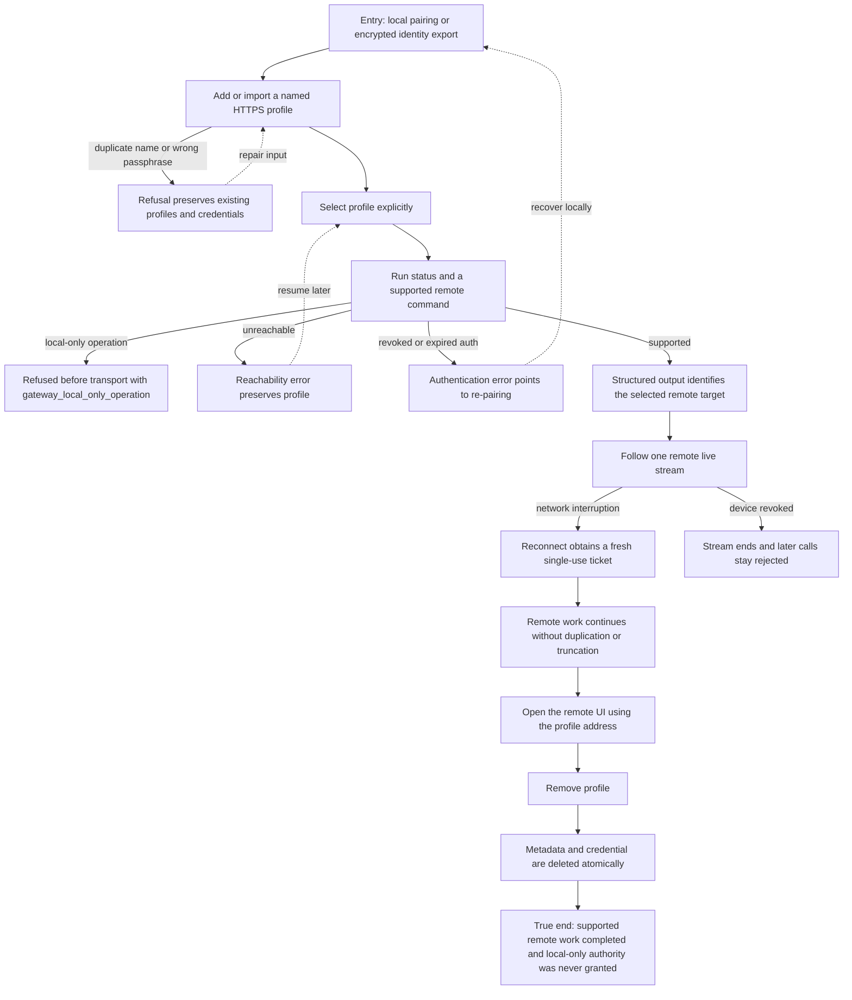

# J-operate-remote-gateway-cli: Operate a remote daemon from the CLI

An operator pairs a work laptop, selects an explicit remote profile, performs supported work with structured output, and can tell reachability, authentication, policy, and stream failures apart.



```yaml
journey:
  id: J-operate-remote-gateway-cli
  name: Operate a remote daemon from the CLI
  value_statement: "I can use the same structured commands against my remote daemon, know which target I am touching, and recover without copying a plaintext credential."
  personas: [Iris, Ada]
  entry_points:
    - url: compozy connect add|import|use
      origin: direct
    - url: compozy pair mint
      origin: direct
    - url: compozy open
      origin: direct
  actions:
    - step: 1
      verb: Create or import a named remote profile
      expected_observable: Metadata and protected credential are stored separately, plaintext never appears in structured output, and wrong-passphrase or duplicate-name failures leave prior profiles intact
    - step: 2
      verb: Select the remote target and inspect status
      expected_observable: Every command makes the remote target explicit and returns the same contract as its supported local counterpart
    - step: 3
      verb: Attempt one supported and one local-only operation
      expected_observable: Supported work reaches the remote daemon; unsupported work is refused deterministically before network effects
    - step: 4
      verb: Interrupt and resume a live stream
      expected_observable: Reconnect uses a fresh ticket and resumes without duplicated or silently missing work
    - step: 5
      verb: Distinguish unreachable, revoked, and policy refusal states
      expected_observable: Stable error identities name the correct next action and never erase a repairable profile
    - step: 6
      verb: Remove the profile
      expected_observable: Profile metadata and credential disappear together while the remote daemon remains unchanged
  goal:
    observable: Supported remote work completes through the selected profile with parseable output and deterministic recovery semantics
    side_effects: [profile-created, credential-protected, remote-operation-attributed, stream-ticket-consumed, profile-removed]
  true_end_state: A fresh profile list and credential-store check show the removed identity is gone, the remote daemon retains completed work, and no local-only capability was exercised remotely
  exit:
    natural: The operator keeps the profile for future work or removes it after the remote task is complete
  abandonment:
    - at_step: 1
      how: Identity import uses the wrong passphrase or conflicts with an existing name
      resume: Correct the input or choose a new name; existing profile and credential bytes remain unchanged
    - at_step: 2
      how: The remote address is unreachable
      resume: Keep the profile, restore connectivity, and retry status without re-pairing
    - at_step: 5
      how: The device credential was revoked and no paired device remains
      resume: Return to the daemon host, mint a new pairing locally, and replace the profile identity
  crosses: [cli, profile-config, credential-store, https, gateway-auth, sse, websocket, remote-operation-matrix]
```

## Coverage notes

- Taxonomy sweep: journey and functional coverage includes profile lifecycle, structured parity, operation gates, streaming, and removal; experiential coverage focuses on target clarity and actionable errors; edge coverage includes wrong passphrase, duplicates, high latency, reconnect, revocation, and partial cleanup; cross-cutting coverage includes two concurrent clients and credential redaction.
- Deliberate skip: browser layout belongs to the pairing journey; this journey validates only `compozy open` destination correctness, not the web surface itself.

