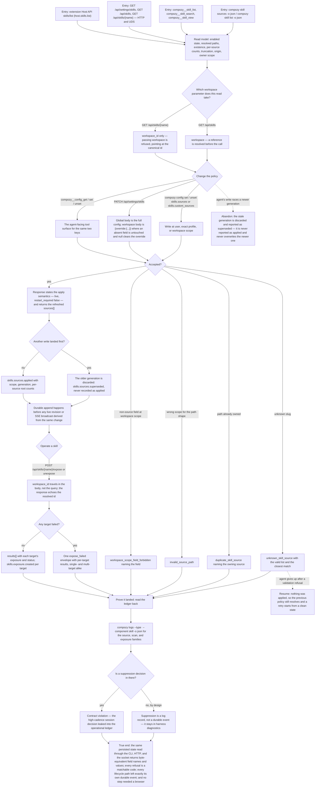

# J-operate-skill-sources-headless — Run the whole feature with no screen

An agent — or an operator over a socket with no browser — has to do everything the Settings page
does: read which folders are scanned and how healthy each one is, change the policy, expose a skill,
and prove afterwards that what it did actually landed. Every answer has to be parseable, identical
whether it came from the CLI, HTTP, or the socket, and every failure has to be a code the agent can
match on rather than a sentence it has to read.



```yaml
journey:
  id: J-operate-skill-sources-headless
  name: "Run the whole feature with no screen"
  value_statement: "Everything the Settings page can do, an agent can do through structured surfaces — with parseable output, identical answers across transports, matchable errors, and a durable record proving what happened."
  personas: [Ada, Dora]
  entry_points:
    - url: "CLI: compozy skill sources -o json, compozy skill list -o json, compozy config get|set|unset skills.sources|skills.custom_sources"
      origin: direct
    - url: "Native tools: compozy__skill_list, compozy__skill_search, compozy__skill_view, compozy__config_get|set|unset"
      origin: agent
    - url: "HTTP and UDS: GET|PATCH /api/settings/skills, GET /api/skills, GET /api/skills/{name}, POST /api/skills/{name}/expose, POST /api/skills/{name}/unexpose"
      origin: direct
    - url: "Extension Host API: skills/list (host.skills.list)"
      origin: agent
    - url: "Ledger: compozy logs --type <event> --component skill -o json, GET /api/logs"
      origin: direct
  actions:
    - step: 1
      verb: "Read the active sources and the skill catalog through every structured surface"
      expected_observable: "Enabled state, resolved paths, existence, counts, truncation, origin, and owner scope come back parseable and identical in field names across CLI, HTTP, UDS, native tools, and the Host API."
    - step: 2
      verb: "Address a workspace on each read"
      expected_observable: "The list route takes a workspace reference; the detail route takes the canonical workspace_id only and refuses the other form by pointing at the canonical one."
    - step: 3
      verb: "Write the two keys at user, exact profile, and workspace scope"
      expected_observable: "The response states live apply semantics and returns the refreshed source read model; the workspace body's absent field is untouched and null clears the override."
    - step: 4
      verb: "Submit each class of invalid input"
      expected_observable: "A deterministic matchable code every time — unknown_skill_source with its valid list and suggestion, duplicate_skill_source, invalid_source_path, workspace_scope_field_forbidden — with nothing applied."
    - step: 5
      verb: "Expose and unexpose a skill without a browser"
      expected_observable: "workspace_id travels in the body and is echoed back; success returns per-target results; any failure returns exactly one expose_failed envelope whether one target failed or several."
    - step: 6
      verb: "Read the ledger back to prove the work landed"
      expected_observable: "Each lifecycle path left exactly its own durable event, a superseded generation is never recorded as applied, and per-suppression decisions are absent from the ledger by design."
  goal:
    observable: "An agent completes the full read-configure-expose-verify loop with no human surface, and can prove from durable records what it changed."
    side_effects: [config-file-written-in-one-layer, apply-record-created, skills-sources-applied-event, skills-sources-superseded-event, skills-sources-apply-failed-event, skills-exposure-created-event, skills-exposure-removed-event, skills-exposure-operation-failed-event]
  true_end_state: "The same persisted state read through CLI, HTTP, and UDS returns byte-equivalent field names and values; native tools and the extension Host API report the same origin for the same skill; every refusal is a matchable code; the durable ledger contains one event per lifecycle path and no suppression records; and no step required the web UI."
  exit:
    natural: "The agent reports the new source policy and its evidence to whoever asked, and keeps working."
  abandonment:
    - at_step: 3
      how: "The agent's write races a newer generation committed by someone else."
      resume: "The stale generation is discarded and reported as superseded — never reported as applied, and never overwriting the newer one."
    - at_step: 4
      how: "The agent gives up after a validation refusal."
      resume: "Nothing was applied, so the previous policy still resolves and a retry starts from a clean state."
    - at_step: 5
      how: "The agent is interrupted between expose targets."
      resume: "Completed targets are compensated and the envelope says so; a later read reports the true reconciled state rather than an optimistic one."
  crosses: [J-absorb-skills-from-other-tools, J-share-skills-with-other-tools, J-diagnose-skill-sources, J-operate-session-via-cli-api, config-overlay, apply-coordinator, observe-ledger, native-tools, extension-host-api, CLI, HTTP, UDS]
```
