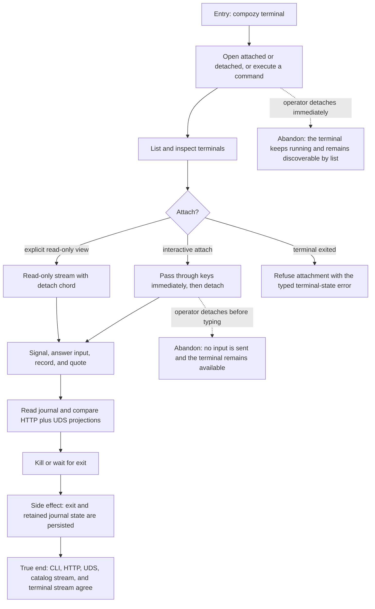

# J-operate-terminal-by-cli — Complete terminal work from the command line

An operator uses the CLI for the whole terminal lifecycle, compares structured results with the
HTTP and UDS contracts, and enters an interactive attachment only when a terminal is available.



```yaml
journey:
  id: J-operate-terminal-by-cli
  name: "Complete terminal work from the command line"
  value_statement: "I can create, inspect, control, audit, and close terminals from scripts or an interactive shell without losing transport truth."
  personas: [Ada, Dora]
  entry_points:
    - url: "CLI: compozy terminal open|list|get|attach|kill|exec|signal|input-requests|respond|journal|record|quote"
      origin: direct
    - url: "HTTP and UDS /api/workspaces/{workspace_id}/terminals surfaces"
      origin: direct
  actions:
    - step: 1
      verb: "Exercise all twelve terminal verbs"
      expected_observable: "Non-interactive commands return structured results; attached open and attach render only their interactive stream contract."
    - step: 2
      verb: "Attach interactively or through an explicit read-only view"
      expected_observable: "Interactive input works immediately without a handoff; read-only views remain passive; banners, detach, replay, and exited-terminal refusal match the documented mode."
    - step: 3
      verb: "Compare CLI reads and mutations with HTTP and UDS"
      expected_observable: "The same profile scope, terminal fields, error codes, journal rows, recordings, and artifacts appear on both transports."
    - step: 4
      verb: "Reconnect the catalog and terminal streams"
      expected_observable: "Catalog SSE and terminal WebSocket resume at their own cursors without crossing profile boundaries."
  goal:
    observable: "Every supported terminal operation is reachable through the CLI and agrees with the public HTTP and UDS contract."
    side_effects: [terminal-created, input-delivered-or-rejected, recording-written, journal-written, terminal-closed]
  true_end_state: "A final list and journal read over CLI, HTTP, and UDS report the same retained terminal outcome, and both streams converge after reconnect."
  exit:
    natural: "The operator detaches from a running terminal or closes a finished one after recording the result."
  abandonment:
    - at_step: 2
      how: "Use the detach chord before the terminal exits."
      resume: "List the terminal and attach again; interactive input is available immediately."
  crosses: [CLI, HTTP, UDS, catalog-SSE, terminal-WebSocket, profile-selection, recordings, journal]
```
