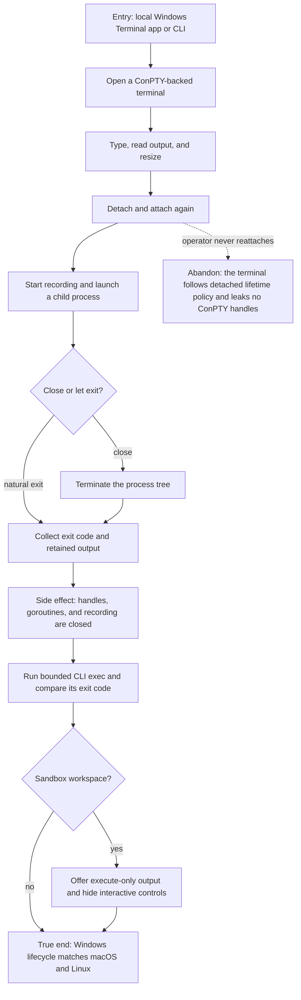

# J-operate-terminal-windows — Run and close a full local terminal on Windows

A Windows operator opens a local interactive terminal, resizes and reattaches to it, records its
output, and closes the whole process tree without changing sandbox workspaces into interactive ones.



```yaml
journey:
  id: J-operate-terminal-windows
  name: "Run and close a full local terminal on Windows"
  value_statement: "I can use the same supervised interactive terminal lifecycle on Windows and trust that closing it cleans up every child process."
  personas: [Dora]
  entry_points:
    - url: "Terminal app and compozy terminal in a local Windows workspace"
      origin: direct
    - url: "Sandbox workspace terminal surfaces"
      origin: direct
  actions:
    - step: 1
      verb: "Open, type in, and resize a local Windows terminal"
      expected_observable: "Input, output, cursor, and dimensions agree through ConPTY."
    - step: 2
      verb: "Detach, reattach, and record"
      expected_observable: "The same terminal resumes from the requested cursor and the recording remains readable."
    - step: 3
      verb: "Close a command with child processes"
      expected_observable: "The whole process tree exits and all ConPTY resources are released."
    - step: 4
      verb: "Compare local interaction with sandbox execution"
      expected_observable: "Local Windows exposes the full lifecycle; sandbox work remains execute-only."
  goal:
    observable: "Windows provides lifecycle parity without process, handle, stream, or capability leaks."
    side_effects: [conpty-created, process-tree-terminated, recording-retained, handles-closed]
  true_end_state: "The final exit state and retained output match across Web and CLI, no child process or ConPTY handle survives, and sandbox controls remain absent."
  exit:
    natural: "The operator closes the finished terminal after verifying its final output."
  abandonment:
    - at_step: 2
      how: "Disconnect after detaching and do not return."
      resume: "A later attach resumes the same terminal until detached retention expires; cleanup then closes every resource."
  crosses: [Windows, ConPTY, process-tree, terminal-stream, recording, CLI, sandbox-capabilities]
```
