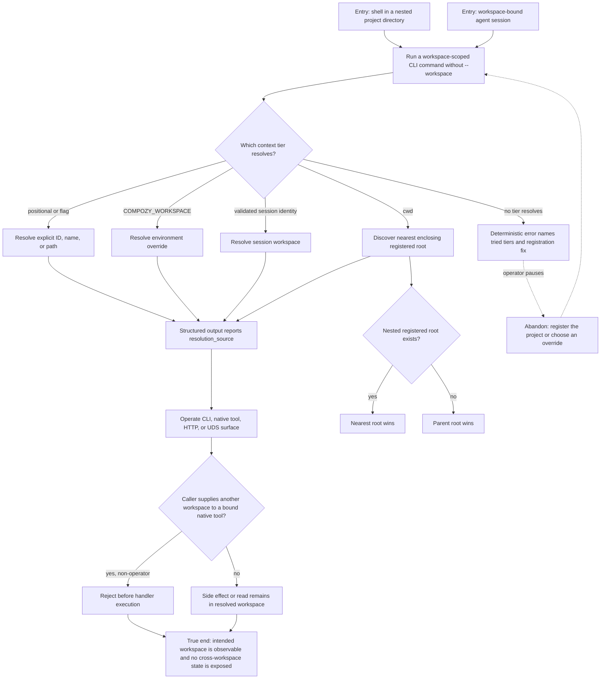

# J-operate-workspace-context — Operate the intended workspace without repeating scope

An autonomous agent or operator works from a registered project tree and lets Compozy resolve the
workspace once from explicit intent, environment, validated session identity, or cwd. Structured
output explains the winning tier, and every stateful surface stays inside that workspace.



```yaml
journey:
  id: J-operate-workspace-context
  name: "Operate the intended workspace without repeating scope"
  value_statement: "People and agents can run workspace-scoped operations from project context while retaining observable, leak-free workspace ownership."
  personas: [Ada, Bruno]
  entry_points:
    - url: "CLI from a registered project or subdirectory"
      origin: direct
    - url: "Compozy-native tool from a workspace-bound session"
      origin: direct
    - url: "HTTP or UDS workspace path reference"
      origin: direct
  actions:
    - step: 1
      verb: "Run a workspace-scoped command without repeating a workspace argument"
      expected_observable: "The command selects the intended workspace through the documented precedence chain"
    - step: 2
      verb: "Inspect structured output"
      expected_observable: "resolution_source names the winning positional, flag, env, session_identity, or cwd tier"
    - step: 3
      verb: "Operate from a nested directory and a nested registered root"
      expected_observable: "The nearest enclosing registered root wins without creating another registration"
    - step: 4
      verb: "Attempt a foreign workspace input from a bound native session"
      expected_observable: "Dispatch rejects the mismatch before the target handler reads or writes data"
  goal:
    observable: "Every operation lands in the intended workspace and reports enough provenance to diagnose context"
    side_effects: [workspace-read, workspace-scoped-mutation]
  true_end_state: "The intended workspace contains the result, sibling workspaces remain unchanged, and no nested registration was minted."
  exit:
    natural: "The operator or agent continues work without repeating workspace scope."
  abandonment:
    - at_step: 1
      how: "No registered workspace encloses cwd and no earlier tier resolves."
      resume: "Register the project or pass --workspace, then rerun the same command."
  crosses: [CLI, native-tools, HTTP, UDS, session-identity, workspace-resolver, isolation]
```

Taxonomy note: functional precedence, nested-root, parseable-error, and cross-surface consistency are
in scope. Visual responsiveness and browser accessibility are not applicable to this structured
control-surface journey.
