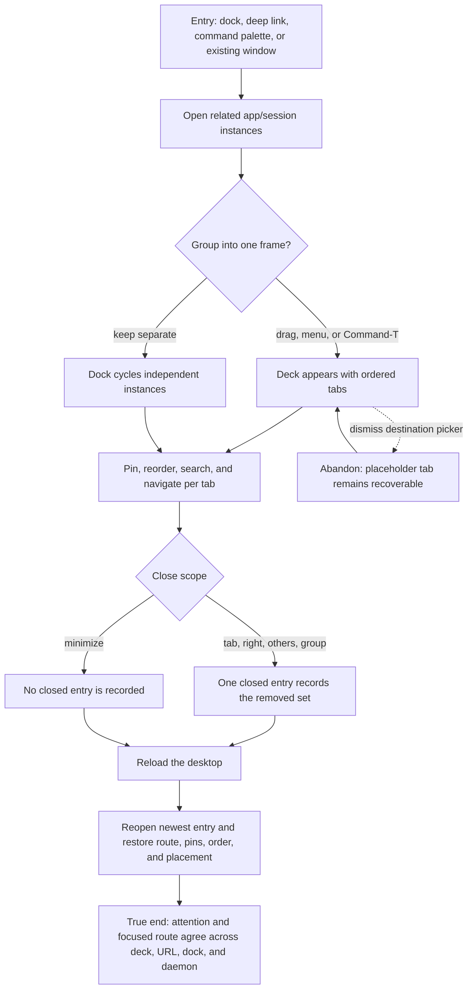

# J-organize-tabbed-work — Organize parallel work in persistent tab frames

A keyboard-heavy operator collects related app and session windows into tab frames, moves among
them without losing route or attention state, closes work at different scopes, and restores it after
a reload.



```yaml
journey:
  id: J-organize-tabbed-work
  name: "Organize parallel work in persistent tab frames"
  value_statement: "An operator can group related work, switch by meaning, and recover closed context without losing route or attention state."
  personas: [Bruno, Théo, Cora]
  entry_points:
    - url: "web / via dock, deck, command palette, keyboard shortcut, or deep link"
      origin: in-app-nav
    - url: "web /tasks, /marketplace, and /agents/{name}/sessions/{id}"
      origin: direct
  actions:
    - step: 1
      verb: "Open several related app or session instances"
      expected_observable: "Each semantic instance is addressable once and the dock cycles the live set in MRU order."
    - step: 2
      verb: "Group windows by drag, context menu, or Command-T destination"
      expected_observable: "A deck appears only at two members, keeps both bodies mounted, and exposes ordered destinations."
    - step: 3
      verb: "Pin, reorder, search, and drill into individual tabs"
      expected_observable: "Pinned tabs remain a prefix; palette and shortcuts activate the existing tab without replacing its route depth."
    - step: 4
      verb: "Close one scope, reload, and reopen"
      expected_observable: "The newest closed entry restores original ids, routes, navigation stacks, pins, order, and frame placement."
  goal:
    observable: "The deck, URL, dock, and daemon identify the same active work before and after reload."
    side_effects: [topology-committed, closed-entry-recorded, route-history-retained]
  true_end_state: "Restored work is focused in the expected frame, its attention remains truthful, and unrelated windows are unchanged."
  exit:
    natural: "The operator continues from the restored tab at its prior route."
  abandonment:
    - at_step: 2
      how: "Dismiss the new-tab destination picker before choosing an app."
      resume: "The placeholder remains visible and can be completed or closed without topology loss."
  crosses: [web-shell, window-manager, sessions, routing, accessibility, persistence]
```
