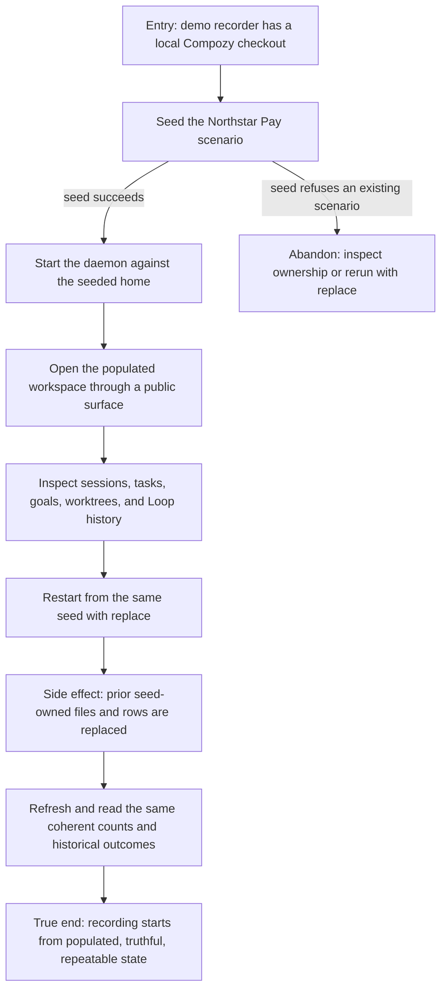

# Prepare a truthful demo recording


```yaml
journey:
  id: J-prepare-demo-recording
  name: Prepare a truthful demo recording
  value_statement: "A recorder can create and recreate one populated product world without stale rows, invented controls, or empty hero surfaces."
  personas: [Dora, Bruno]
  entry_points:
    - url: go run ./scripts/demo-seed
      origin: direct
  actions:
    - step: 1
      verb: Seed the Northstar Pay scenario into an isolated Compozy home
      expected_observable: The command reports populated counts across workspaces, sessions, tasks, Loops, goals, worktrees, memory, network, automation, and observability
    - step: 2
      verb: Start Compozy against that home and inspect the scenario
      expected_observable: Public read surfaces return the seeded world and mark imported Loop runs as history
    - step: 3
      verb: Seed the same home again with replace and refresh
      expected_observable: Counts stay stable, obsolete seed-owned files disappear, and runtime boot does not rewrite historical outcomes
  goal:
    observable: The same populated scenario is ready for recording after every replace and daemon restart
    side_effects: [seed-owned-records-replaced, seed-owned-files-replaced]
  true_end_state: The recorder can begin capture from a populated world whose displayed state matches persisted daemon state
  exit:
    natural: The recorder opens a seeded hero surface and starts the capture workflow
  abandonment:
    - at_step: 1
      how: The target workspace exists but is not owned by the demo seed
      resume: Choose an isolated home or remove the conflict manually; replace never deletes unowned content
  crosses: [CLI, daemon, SQLite, HTTP, Web, workspace files, Git worktrees]
```
