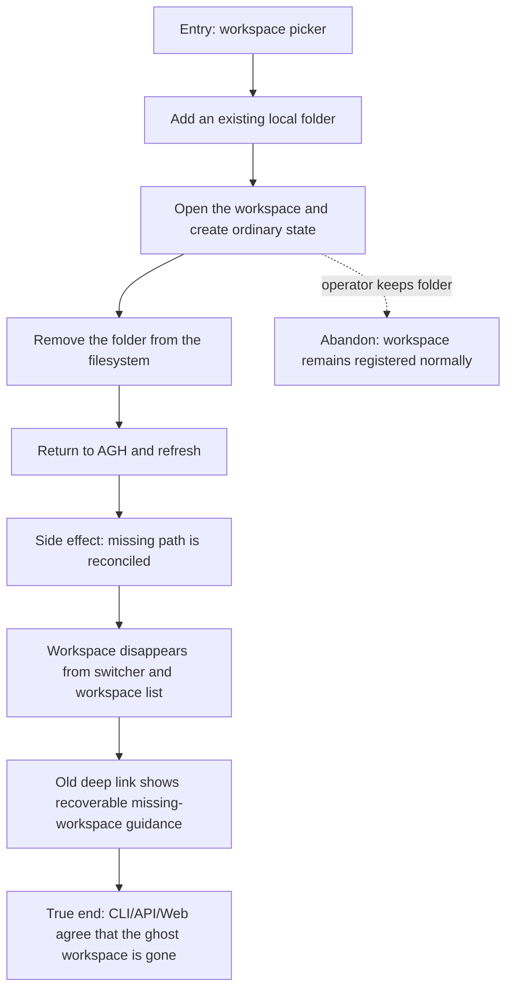

# J-prune-missing-workspace — Remove a missing local workspace

An operator registers a local folder, uses it, removes that folder outside AGH,
and returns. AGH discovers that the path no longer exists and removes the
workspace from every public catalog instead of preserving a ghost.



```yaml
journey:
  id: J-prune-missing-workspace
  name: "Remove a missing local workspace"
  value_statement: "My workspace list mirrors folders that still exist, so stale local paths do not trap navigation or automation."
  personas: [Bruno]
  entry_points:
    - url: "web workspace picker"
      origin: in-app-nav
    - url: "CLI agh workspace list"
      origin: direct
  actions:
    - step: 1
      verb: "Register an existing local folder"
      expected_observable: "The workspace appears once and opens successfully"
    - step: 2
      verb: "Remove the folder outside AGH"
      expected_observable: "No manual AGH delete is required"
    - step: 3
      verb: "Return and refresh"
      expected_observable: "The missing workspace is reconciled out of the switcher and list"
    - step: 4
      verb: "Open the prior deep link and check a structured list"
      expected_observable: "The deep link recovers visibly and CLI/API/Web no longer enumerate the workspace"
  goal:
    observable: "No user-facing surface retains the removed workspace"
    side_effects: [workspace-registration-pruned, active-workspace-reselected]
  true_end_state: "After a fresh browser load and structured list read, the missing path is absent and another valid workspace remains usable."
  exit:
    natural: "The operator continues in an existing valid workspace."
  abandonment:
    - at_step: 2
      how: "The operator changes their mind and leaves the folder in place."
      resume: "The workspace remains registered and usable with no reconciliation side effect."
  crosses: [workspace-registry, filesystem-reconciliation, web-switcher, CLI, HTTP, UDS]
```
