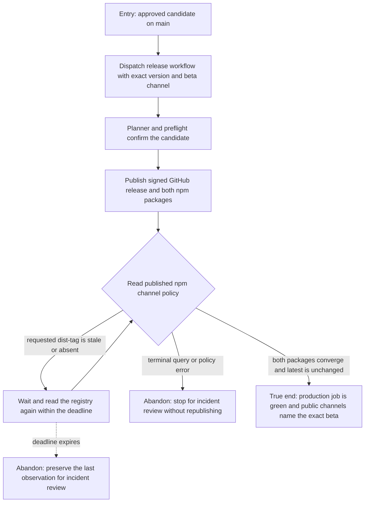

# J-publish-compozy-beta: Publish one beta through the guarded release workflow



```yaml
journey:
  id: J-publish-compozy-beta
  name: "Publish one guarded Compozy beta"
  value_statement: "A release administrator can publish one immutable beta and distinguish temporary registry propagation from a real channel-policy failure without republishing it."
  personas: [Dora]
  entry_points:
    - url: ".github/workflows/release.yml"
      origin: direct
    - url: "GitHub Actions / Release / Run workflow"
      origin: in-app-nav
  actions:
    - step: 1
      verb: "Dispatch the approved commit, version, and beta channel"
      expected_observable: "The release plan and preflight name the exact checked-out candidate before publication starts"
    - step: 2
      verb: "Observe the signed GitHub and npm publications"
      expected_observable: "GoReleaser and the extension SDK publisher each report success for the same version"
    - step: 3
      verb: "Wait for the public npm channel policy"
      expected_observable: "Stale or missing dist-tags are re-read within a fixed deadline, while terminal query and policy errors stop immediately"
    - step: 4
      verb: "Confirm the release from a fresh public read"
      expected_observable: "Both packages expose the requested beta version, latest remains unchanged, and the production job is green"
  goal:
    observable: "One production run publishes the exact candidate and closes only after every public channel policy is observable"
    side_effects: [git-tags-created, github-release-published, npm-packages-published]
  true_end_state: "The production workflow is green, the GitHub release is a prerelease, both npm beta dist-tags name the exact version, and neither immutable package needs to be republished."
  exit:
    natural: "Hand the published version to the post-release install and provenance checks."
  abandonment:
    - at_step: 3
      how: "The registry query fails, a beta moves latest, malformed policy data is returned, or the readiness deadline expires."
      resume: "Stop for incident review with the last observation; never overwrite tags or republish an immutable npm version."
  crosses: [release-workflow, github-releases, sigstore, npm-cli-package, npm-extension-sdk]
```
