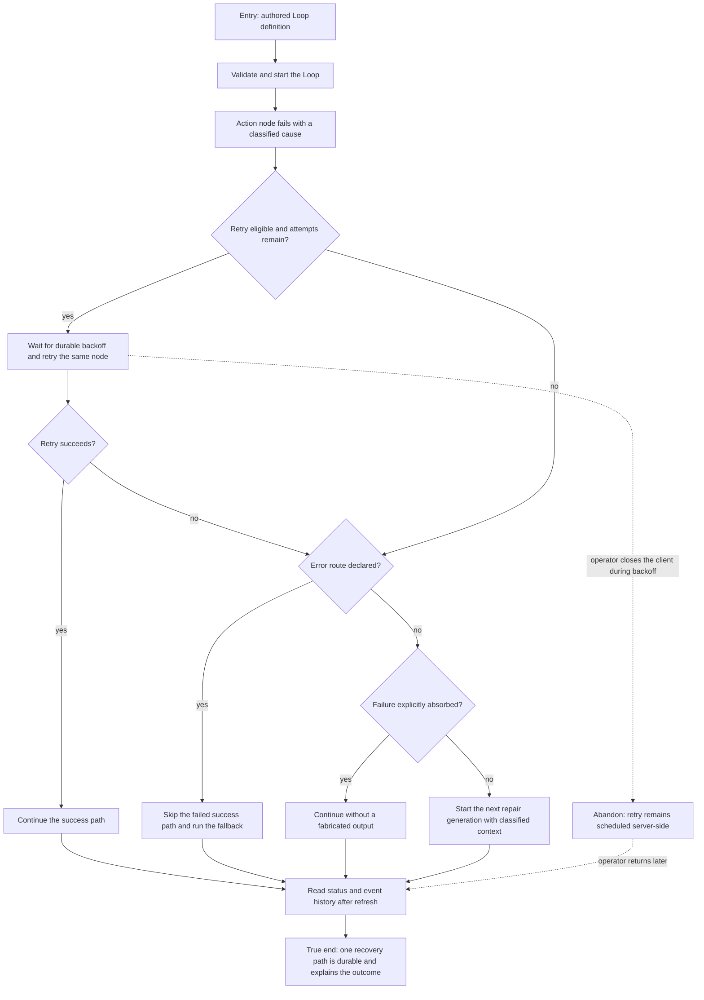

# J-recover-loop-node-failure — Recover a Loop node failure safely

A Loop author declares how a failed node should recover, runs the Loop through a controlled
failure, and confirms that the runtime takes exactly one precedence path. A transient failure
retries the same node, an error route activates its fallback, and an unhandled failure starts a
repair generation with the original cause intact.



```yaml
journey:
  id: J-recover-loop-node-failure
  name: "Recover a Loop node failure safely"
  value_statement: "A Loop author can trust one deterministic recovery path to handle each failed node without duplicate work or a hidden cause."
  personas: [Ada, Bruno]
  entry_points:
    - url: "CLI: compozy loop validate|run|status"
      origin: direct
    - url: "HTTP/UDS Loop definition, run, status, and event routes"
      origin: direct
    - url: "native tools: compozy__loop_status"
      origin: direct
  actions:
    - step: 1
      verb: "Author and validate one retry, error-route, or escalation path"
      expected_observable: "The definition is accepted with no hidden recovery defaults"
    - step: 2
      verb: "Start the Loop and trigger one classified node failure"
      expected_observable: "The runtime chooses retry before route, route before absorption, and absorption before escalation"
    - step: 3
      verb: "Return after the recovery settles and read the run again"
      expected_observable: "Status and event history expose one durable outcome with the original failure context"
  goal:
    observable: "The Loop heals, follows its fallback, or starts repair exactly once according to the authored policy"
    side_effects: [attempt-recorded, retry-scheduled, fallback-activated, repair-generation-started]
  true_end_state: "After refresh or daemon restart, public reads agree on the chosen recovery path, final node state, and classified cause, with no duplicate node run."
  exit:
    natural: "The author can explain why the Loop continued and which work ran."
  abandonment:
    - at_step: 2
      how: "The operator closes the client while a retry is waiting."
      resume: "The server keeps the durable schedule; returning later shows the single settled attempt history."
  crosses: [loop-dsl, loop-coordinator, scheduler, globaldb, CLI, HTTP, UDS, native-tools, SSE]
```

Taxonomy note: the three recovery branches cover the functional and error dimensions; the
backoff abandonment path covers continuity; cross-surface reads cover consistency and workspace
isolation. Web experience and responsive presentation are deferred to the task_08 surface.
