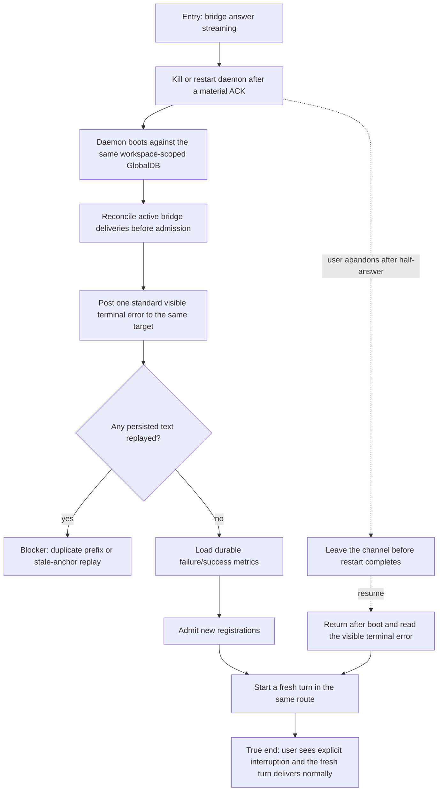

# J-recover-mid-turn-restart — Recover visibly after a mid-turn daemon restart

An operator interrupts a streaming bridge delivery by restarting the daemon. The implemented
checkpoint-only contract does not replay prior text: boot reconciliation posts one new visible
terminal error, preserves durable metrics, and completes before new delivery registrations are
admitted.



```yaml
journey:
id: J-recover-mid-turn-restart
  name: "Recover visibly after a mid-turn daemon restart"
  value_statement: "I am never left wondering whether a half-answer is still running; AGH makes the interruption visible and accepts new work only after recovery."
  personas: [Omar, Maya]
  entry_points:
    - url: "Bridge conversation while an agent turn is streaming"
      origin: external-share
    - url: "Operator daemon restart and bridge metrics surfaces"
      origin: direct
  actions:
    - step: 1
      verb: "Restart the daemon after the provider has acknowledged part of a turn"
      expected_observable: "The bridge runtime closes and restarts against the same persisted workspace state"
    - step: 2
      verb: "Observe boot reconciliation before submitting new work"
      expected_observable: "Every active row is reconciled before registration admission opens"
    - step: 3
      verb: "Read the channel and metrics after boot"
      expected_observable: "One standard terminal error is visible, no prior text is replayed, and durable counters retain the pre-restart history"
    - step: 4
      verb: "Submit a fresh turn"
      expected_observable: "The new registration is accepted only after reconciliation and delivers without duplication"
  goal:
    observable: "The interrupted route contains a visible terminal failure, no duplicate streamed prefix, durable metrics, and a successful post-recovery turn."
    side_effects: [delivery-checkpoint-read, terminal-error-posted, durable-metrics-loaded, broker-admission-opened]
  true_end_state: "After reconnect and a fresh turn, the channel distinguishes the interrupted attempt from the new answer and no active delivery remains orphaned."
  exit:
    natural: "The operator keeps the bridge in service with an auditable interruption."
  abandonment:
    - at_step: 1
      how: "The teammate leaves after seeing a half-answer and assumes the agent is still running."
      resume: "Returning after daemon boot shows the explicit terminal error and permits a deliberate fresh retry."
  crosses: [delivery-ledger, globaldb, daemon-boot, provider-delivery, workspace-isolation, delivery-metrics]
```

Automated backbone: `_tests.md` integration 5.13–5.15 and E2E runtime 6.6. Task 10 verifies
the user-visible fail-open result rather than expecting unsupported text replay.
