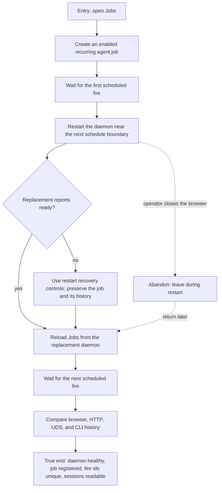

# J-recover-scheduled-job-restart — Recover scheduled work across a daemon restart

A delivery operator restarts the daemon while a recurring job is active. The replacement daemon
must become ready, the job must remain registered, and fresh browser, HTTP, UDS, and CLI reads must
agree on unique scheduled fires and their linked sessions.



```yaml
journey:
  id: J-recover-scheduled-job-restart
  name: "Recover scheduled work across a daemon restart"
  value_statement: "I can restart Compozy while scheduled work is active without losing the job, duplicating a fire, or making the replacement daemon unavailable."
  personas: [Bruno]
  entry_points:
    - url: "web /jobs"
      origin: in-app-nav
    - url: "POST /api/settings/actions/restart"
      origin: direct
  actions:
    - step: 1
      verb: "Create an enabled recurring agent job and wait for its first scheduled fire"
      expected_observable: "Jobs shows the run and its durable fire id and linked session"
    - step: 2
      verb: "Restart the daemon near the next schedule boundary"
      expected_observable: "The restart operation reaches ready without an identity mismatch or a dead replacement"
    - step: 3
      verb: "Reload Jobs and wait for the next scheduled fire"
      expected_observable: "The job remains registered and new history appears without re-creating it"
    - step: 4
      verb: "Compare the fresh browser, HTTP, UDS, and CLI projections"
      expected_observable: "Every surface reports unique fire ids, the same job state, and readable linked sessions"
  goal:
    observable: "The replacement daemon is healthy and the recurring job continues from durable state with no duplicate fire or orphaned session identity."
    side_effects: [replacement-daemon-ready, scheduled-history-preserved, session-identity-reconciled]
  true_end_state: "A fresh Jobs load and independent structured reads agree that the scheduler is running, the job is registered, and post-restart fires are unique."
  exit:
    natural: "The operator returns to the job detail after confirming restart recovery."
  abandonment:
    - at_step: 2
      how: "The operator closes the browser while the daemon is restarting."
      resume: "Reopening Jobs reads the replacement daemon and the same durable job history without a manual repair."
  crosses: [automation-scheduler, session-creation, global-catalog, daemon-restart, web, HTTP, UDS, CLI]
```
