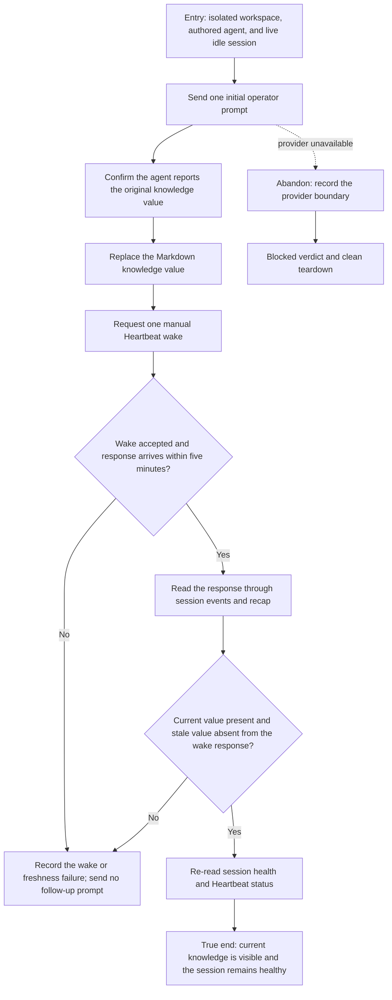

# J-refresh-agent-knowledge — Notice changed workspace knowledge on the next wake

This journey proves that an operator can update workspace reference material and trust an already
active agent to receive the current bytes on its next eligible synthetic wake. The file change does
not wake the agent by itself. The operator requests one documented Heartbeat wake, sends no second
session prompt, and confirms the response through a fresh public session read.



```yaml
journey:
  id: J-refresh-agent-knowledge
  name: "Notice changed workspace knowledge on the next wake"
  value_statement: "An operator can update workspace reference material and trust an active agent to use the current version on its next eligible wake without another session prompt."
  personas: [Bruno]
  entry_points:
    - url: "workspace knowledge Markdown plus compozy session and agent heartbeat CLI"
      origin: direct
  actions:
    - step: 1
      verb: "Start one provider-backed agent session and establish the original knowledge value"
      expected_observable: "The initial response cites the original value and the session becomes idle and wake-eligible."
    - step: 2
      verb: "Replace the workspace knowledge value"
      expected_observable: "The current Markdown file contains only the replacement value."
    - step: 3
      verb: "Request one documented Heartbeat wake without sending another session prompt"
      expected_observable: "The wake is accepted and the agent responds within five minutes using the replacement value."
    - step: 4
      verb: "Read the result through fresh public session surfaces"
      expected_observable: "Session events and recap agree on the current value, while health and Heartbeat status remain usable."
  goal:
    observable: "The first post-change synthetic response uses the current workspace knowledge bytes within five minutes."
    side_effects: [heartbeat-wake-audit, session-turn, provider-response]
  true_end_state: "A fresh session read shows the current value in the synthetic-wake response, the stale value is not presented as current, and the session remains healthy without a second operator prompt."
  exit:
    natural: "The operator reads the settled session and tears down the isolated lab with no surviving process."
  abandonment:
    - at_step: 1
      how: "The native provider is unavailable or the session cannot become wake-eligible."
      resume: "The run records the exact blocked boundary and starts a fresh lab only after the prerequisite is restored."
    - at_step: 3
      how: "No response arrives before the five-minute deadline."
      resume: "The run records a failure without prompting the agent again, then tears down the lab."
  crosses: [workspace-filesystem, prompt-composition, heartbeat-service, provider-session, cli, uds]
```
