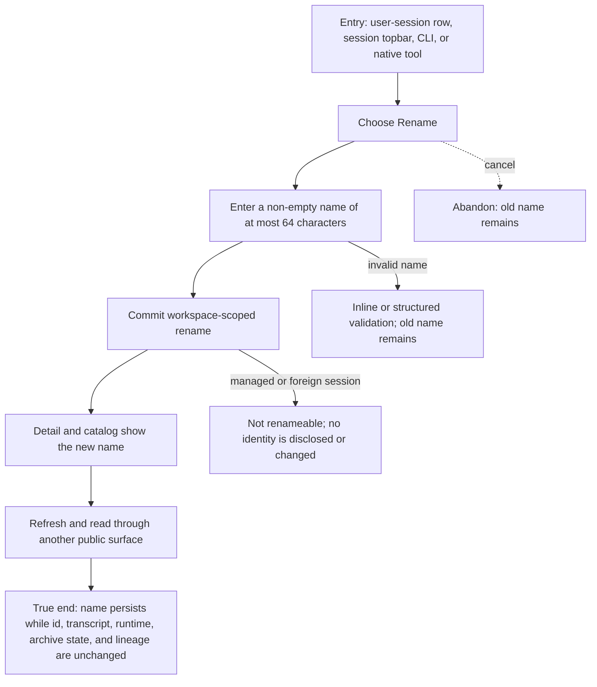

# J-rename-session: Rename a session without changing its work



```yaml
journey:
  id: J-rename-session
  name: "Rename a session without changing its work"
  value_statement: "People and agents can give a user session a durable recognizable name without changing its runtime or history."
  personas: [Dora, Ada]
  entry_points:
    - url: "web session row or session topbar → Rename session"
      origin: in-app-nav
    - url: "compozy session rename <id> <name>"
      origin: direct
    - url: "compozy__session_rename"
      origin: direct
  actions:
    - step: 1
      verb: "Choose rename for a user session"
      expected_observable: "A labelled name field opens with the current durable name."
    - step: 2
      verb: "Save a valid new name"
      expected_observable: "The detail title and catalog reconcile to the new name."
    - step: 3
      verb: "Refresh and read the same session through another surface"
      expected_observable: "Web, CLI, HTTP, UDS, and the native tool agree on the name and session identity."
    - step: 4
      verb: "Try invalid, managed, and foreign-session renames"
      expected_observable: "Each rejection preserves the old identity and workspace boundary."
  goal:
    observable: "The new name is durable and consistent everywhere."
    side_effects: [session-name-updated, catalog-wake-published]
  true_end_state: "After refresh or daemon restart, only the display name changed; id, transcript, runtime, archive state, and lineage are intact."
  exit:
    natural: "The operator recognizes the session and continues its work."
  abandonment:
    - at_step: 2
      how: "The operator cancels or closes the dialog."
      resume: "The prior name remains and a later rename starts from it."
  crosses: [web, CLI, HTTP, UDS, native-tools, session-manager, catalog-stream, workspace-isolation]
```
