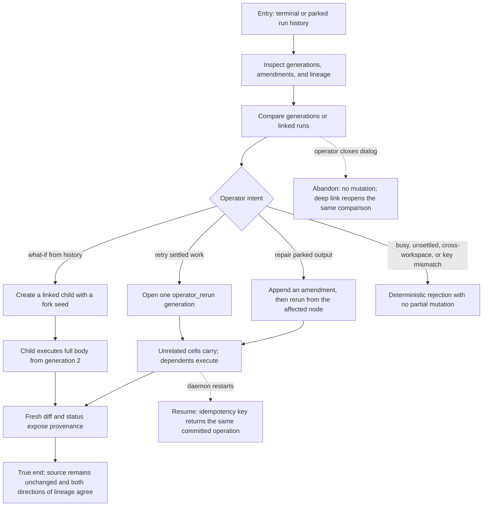

# J-replay-loop-history — Compare, repair, rerun, and fork Loop history



```yaml
journey:
  id: J-replay-loop-history
  name: "Compare, repair, rerun, and fork Loop history"
  value_statement: "An operator can understand prior work, repair a durable output, retry only what is needed, or branch a what-if run without rewriting history."
  personas: [Bruno, Ada]
  entry_points:
    - url: "web /loop-runs/:runId, /diff, Amend, Rerun, and Fork dialogs"
      origin: in-app-nav
    - url: "CLI: compozy loop diff|rerun|fork and loop node amend"
      origin: direct
    - url: "HTTP/UDS diff, rerun, fork, amend, and run-detail routes"
      origin: direct
    - url: "native tools: compozy__loop_diff|rerun|fork|node_amend"
      origin: direct
  actions:
    - step: 1
      verb: "Inspect and compare durable history"
      expected_observable: "Diffs identify carried, changed, skipped, amended, and live cells without mutating either side."
    - step: 2
      verb: "Amend a parked settled output or choose a settled rerun point"
      expected_observable: "The immutable recorded value remains in history and the effective value or rerun set is previewed before commit."
    - step: 3
      verb: "Rerun or fork with an explicit request id"
      expected_observable: "One atomic operation commits; exact replay returns it and mismatched reuse is rejected."
    - step: 4
      verb: "Refresh source and destination runs"
      expected_observable: "Rerun provenance, fork seed, executing generation, two-way lineage, and unchanged source agree across surfaces."
  goal:
    observable: "The operator reaches a truthful new generation or linked child while preserving every prior record."
    side_effects: [append-only-amendment, timetravel-intent, generation-or-child-run, lineage-event]
  true_end_state: "Fresh source and child reads, plus a daemon-side diff, agree on provenance and lineage; the source bytes and unrelated cells are unchanged."
  exit:
    natural: "Operator lands on the new generation or forked run with history links back to the source."
  abandonment:
    - at_step: 2
      how: "The operator closes a mutation dialog after reviewing the preview."
      resume: "No operation exists; reopening shows the same source state."
    - at_step: 3
      how: "The daemon restarts after acknowledging the request."
      resume: "Replaying the same request id resolves to the one committed operation."
  crosses: [amendment-overlay, timetravel-store, generation-planner, fork-seed, CLI, HTTP, UDS, native-tools, web-history]
```

