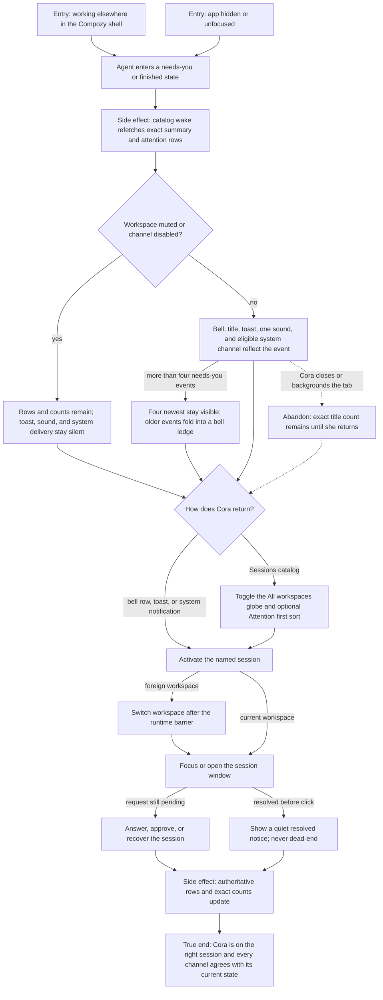

# J-respond-to-agent-attention — Notice and answer agent attention

Cora delegates work, keeps moving, and returns only when Compozy tells her that an agent needs a
decision or has finished. The signal may arrive in the shell, the tab title, a toast, a sound, or an
opt-in system notification; every channel must point back to the same daemon truth and land on the
right session even when another workspace is active.



```yaml
journey:
  id: J-respond-to-agent-attention
  name: "Notice and answer agent attention"
  value_statement: "A person can leave agent work running, notice only the events that matter, and return to the exact session without losing workspace context or trusting stale counts."
  personas: [Cora, Théo, Sol]
  entry_points:
    - url: "web CompozyOS shell attention bell and Sessions catalog"
      origin: in-app-nav
    - url: "in-app toast, tab title, sound, or opt-in system notification"
      origin: push
    - url: "web Settings → Attention"
      origin: in-app-nav
    - url: "browser tab title and restored session window"
      origin: direct
  actions:
    - step: 1
      verb: "Leave one or more agent sessions running while working elsewhere"
      expected_observable: "The exact cross-workspace needs-you count appears in the bell and title; finished work is listed separately and never inflates the count"
    - step: 2
      verb: "Notice an allowed attention signal"
      expected_observable: "An unfocused session delivers its configured channels once; focused or muted work stays silent while its row and count remain truthful"
    - step: 3
      verb: "Activate the signal or find the session in the widened catalog"
      expected_observable: "The shell switches workspace when required, waits for the destination runtime, and focuses or opens the named session"
    - step: 4
      verb: "Answer the pending request, or arrive after somebody else resolved it"
      expected_observable: "The current session opens in both cases; a resolved signal shows a quiet notice rather than an error or dead end"
    - step: 5
      verb: "Reload and revisit the attention settings and session catalog"
      expected_observable: "Channel policy, mute choices, list scope, and sort round-trip through daemon settings while current counts and rows re-read from the daemon"
  goal:
    observable: "The person reaches the correct session and can act, with every attention surface agreeing on what still needs them"
    side_effects: [catalog-refetched, notification-delivered, workspace-switched, session-focused, preferences-persisted]
  true_end_state: "After the request is handled or found already resolved, the session remains open in its owning workspace, exact counts update from the daemon, muted policy still persists after reload, and no stale toast or hidden workspace row claims otherwise."
  exit:
    natural: "The person continues the session or returns to other work with a quiet attention surface."
  abandonment:
    - at_step: 2
      how: "The person backgrounds or closes the tab without opening the signal."
      resume: "The exact title and bell count remain authoritative on return; reconnect does not replay a toast storm."
  crosses: [web-shell, session-catalog, SSE, settings, browser-notifications, workspace-runtime, window-manager]
```

Taxonomy note: the six linked scenarios cover the end-to-end journey, channel and persistence
mechanics, notification permission/failure paths, quiet and overflow states, keyboard-accessible
non-color signals, and cross-workspace continuity. Phone layout is skipped because the touched host
surface is the desktop OS shell; Sol's keyboard/screen-reader pass remains in scope for Task 08.

design_reference:
  locked_root: "docs/design/opendesign/herdr-parity/"
  visual_contracts:
    - "task_03 VC-01..VC-10 — herdr-parity-sidebar.html"
    - "task_03 VC-11..VC-16 — herdr-parity-bell.html"
    - "task_03 VC-17..VC-20 — herdr-parity-toasts.html"
    - "task_03 VC-21..VC-23 — herdr-parity-settings-attention.html"
  judgment_rule: "Use runtime data and COPY.md wording inside the locked visual language; record authorized deltas rather than copying prototype content or host chrome."
