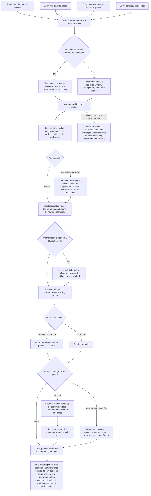

# J-restore-per-profile-state — Come back to each context exactly as I left it

An operator arranges desktops and windows in one context, switches to another, and finds a clean
slate rather than the first context's screen. Switching back restores the arrangement they left,
including which desktop was active. The same rule holds for the quieter per-profile state — what
each context considers muted and what its badges count.



```yaml
journey:
  id: J-restore-per-profile-state
  name: "Come back to each context exactly as I left it"
  value_statement: "Each of my contexts keeps its own screen and its own quiet, so switching does not cost me my layout or bury me in another context's alerts."
  personas: [Bruno, Théo, Dora]
  entry_points:
    - url: "Menubar profile switcher and the web desktop pager"
      origin: in-app-nav
    - url: "HTTP and UDS: GET /api/workspaces/{workspace_id}/window-manager?profile=, its preview and commands routes"
      origin: direct
    - url: "CLI: compozy desktop list, compozy profile archive|unarchive|delete"
      origin: direct
    - url: "Web Settings → Attention and the dock and menubar badges"
      origin: in-app-nav
  actions:
    - step: 1
      verb: "Arrange desktops and windows in one profile"
      expected_observable: "The arrangement commits under that profile's partition of the workspace and survives a reload."
    - step: 2
      verb: "Switch to a second profile in the same workspace"
      expected_observable: "It enters on a single seeded default desktop with none of the first profile's windows on screen."
    - step: 3
      verb: "Switch back and forth"
      expected_observable: "Each arrangement returns exactly as it was left, in both directions, including which desktop is active."
    - step: 4
      verb: "Open a second client on the other profile"
      expected_observable: "Neither client shows the other's windows, and neither is force-switched when its peer switches."
    - step: 5
      verb: "Mute a workspace and read the badges"
      expected_observable: "The mute applies to the profile that set it, another profile still counts that workspace, and the attention summary and badges follow the acting profile."
    - step: 6
      verb: "Archive the profile, then unarchive it"
      expected_observable: "The operator lands on default, the arrangement is retained untouched while archived, and unarchive returns it unchanged."
    - step: 7
      verb: "Delete an empty profile that owns saved desks"
      expected_observable: "The delete preview counts the saved arrangements, the applied delete removes every one of them, and every other profile's desks are unchanged."
  goal:
    observable: "Desktop arrangements, active-desktop choice, and attention state are per profile per workspace, restored on return and removed only by that profile's deletion."
    side_effects: [window-manager-snapshot-committed-per-profile-partition, client-registration-claim-retired-and-reclaimed, attention-mute-recorded, desktop-partitions-counted-in-the-delete-preview, desktop-partitions-purged-on-delete]
  true_end_state: "Reopening each profile in each workspace restores its own desktops and windows with nothing carried over from the other profile, and after a delete no arrangement of the removed profile survives anywhere."
  exit:
    natural: "The operator resumes work on the screen they left in the context they chose."
  abandonment:
    - at_step: 1
      how: "The client closes mid-arrangement."
      resume: "The last committed snapshot returns on reopen; an in-flight commit finishes before any teardown enumerates the repository."
    - at_step: 3
      how: "Two profile switches overlap from different clients."
      resume: "Registration serialises retire and register so the destination is never stranded by a stale unregister."
    - at_step: 6
      how: "The operator abandons the archive confirmation."
      resume: "The profile stays active and its arrangement is untouched."
  crosses: [J-operate-profiles, J-scope-work-by-profile, J-administer-window-manager, J-operate-desktop-shell, windowmanager-registry, clientstate, attention-service, notifications, Web shell, CLI, HTTP, UDS]
```
