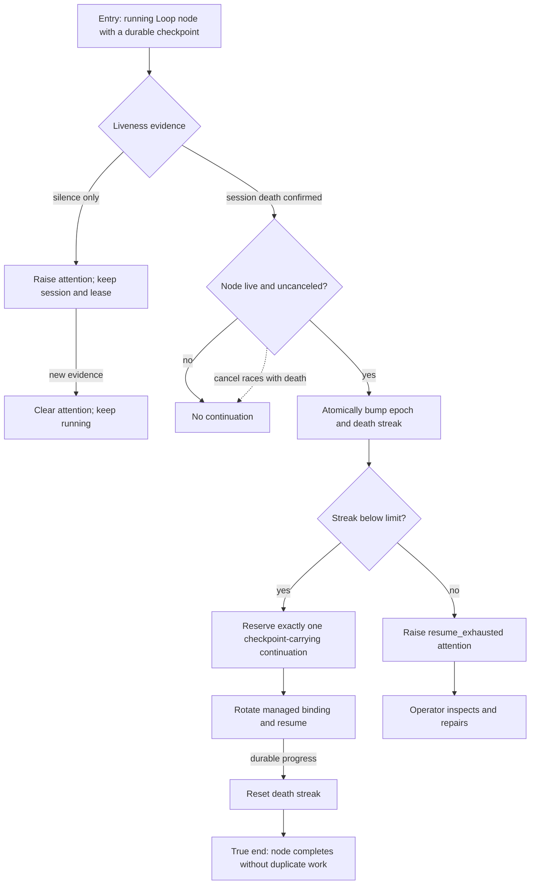

# J-resume-dead-loop-node — Resume a Loop node after managed-session death

An operator leaves a long-running Loop unattended, its managed agent session dies, and the daemon
re-enters the same node from its durable checkpoint exactly once. Silence is not death, cancellation
wins any race, and repeated death eventually asks for attention instead of looping forever.



```yaml
journey:
  id: J-resume-dead-loop-node
  name: "Resume a Loop node after managed-session death"
  value_statement: "Long-running Loop work survives a dead managed session without treating silence as failure or creating duplicate continuations."
  personas: [Ada, Bruno]
  entry_points:
    - url: "CLI: compozy loop status --run-id <run-id>; compozy loop nodes"
      origin: direct
    - url: "HTTP/UDS Loop run, node inventory, and event routes"
      origin: direct
  actions:
    - step: 1
      verb: "Start a checkpointing node and terminate its managed session"
      expected_observable: "Confirmed death rotates the binding and reserves one continuation from the latest checkpoint"
    - step: 2
      verb: "Race cancellation with death detection"
      expected_observable: "Cancellation wins and no continuation is created"
    - step: 3
      verb: "Resume once with progress, then inject consecutive deaths"
      expected_observable: "Progress resets the streak; three deaths without progress raise resume_exhausted attention and stop automatic continuation"
  goal:
    observable: "The node resumes exactly once from durable progress or parks with a forensically useful attention reason"
    side_effects: [binding-rotated, cell-epoch-bumped, continuation-reserved, attention-event]
  true_end_state: "Fresh public reads show one active binding and one continuation per confirmed death, with no resume after cancellation or while parked."
  exit:
    natural: "The resumed node completes, or the operator deliberately repairs a resume_exhausted node."
  abandonment:
    - at_step: 1
      how: "The operator remains away after the session dies."
      resume: "The durable authority resumes once without a client; the operator later reads the settled outcome."
  crosses: [managed-session, loop-coordinator, GlobalDB, checkpoint, CLI, HTTP, UDS, events]
```

Coverage taxonomy: a structured runtime journey covering chaos recovery, cancel/death concurrency,
restart continuity, and public-state consistency. Web presentation is covered by the later lifecycle
UI journey.
