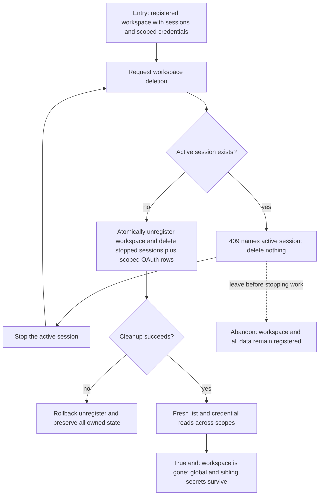

# J-retire-workspace — Retire a workspace without orphaned private state

A builder removes a registered workspace only after active work is stopped. The operation is
atomic: stopped sessions and workspace-owned OAuth secrets disappear together, while global and
sibling-workspace data remain intact.



```yaml
journey:
  id: J-retire-workspace
  name: "Retire a workspace without orphaned private state"
  value_statement: "I can remove a project cleanly without deleting active work or credentials owned by another scope."
  personas: [Bruno]
  entry_points:
    - url: "HTTP or UDS DELETE /api/workspaces/:id"
      origin: direct
    - url: "workspace management surface"
      origin: in-app-nav
  actions:
    - step: 1
      verb: "Attempt deletion while a session is active"
      expected_observable: "The request returns 409 with the active session and performs no partial cleanup"
    - step: 2
      verb: "Stop active work and retry"
      expected_observable: "The workspace unregister, stopped-session deletion, and scoped credential cleanup commit atomically"
    - step: 3
      verb: "Read workspace, session, and credential catalogs again"
      expected_observable: "Owned rows are absent while global and sibling-workspace rows remain usable"
  goal:
    observable: "The workspace and all of its private stopped state are gone without cross-scope deletion"
    side_effects: [workspace-unregistered, stopped-sessions-deleted, workspace-oauth-deleted]
  true_end_state: "Fresh HTTP and UDS reads cannot resolve the retired workspace or its stopped sessions, and unrelated credentials still decrypt and operate."
  exit:
    natural: "The builder continues in a remaining workspace."
  abandonment:
    - at_step: 1
      how: "Leave after the active-session conflict."
      resume: "Nothing was deleted; stop the named session and repeat the same request."
  crosses: [workspace-registry, sessions, oauth-store, encrypted-secrets, HTTP, UDS, transaction-boundary]
```
