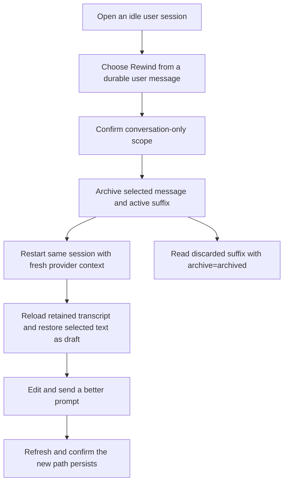

# J-rewind-conversation — Return to an earlier conversation point

A returning session user abandons a mistaken conversational path without creating a second session. They choose an earlier durable user message, confirm the limited scope, return the active transcript to the prefix before that message, edit the restored prompt, and continue with fresh provider context. The discarded suffix remains available only through explicit archived event reads.



```yaml
journey:
  id: J-rewind-conversation
  name: "Return to an earlier conversation point"
  value_statement: "A user can abandon a mistaken conversational path in place, keep the useful prefix, and continue from fresh provider context without implying that external side effects were undone."
  personas: [Théo, Ada]
  entry_points:
    - url: "Web session thread message actions"
      origin: direct
    - url: "CLI: compozy session rewind"
      origin: direct
    - url: "HTTP/UDS: POST /api/workspaces/:workspace_id/sessions/:session_id/rewind"
      origin: direct
  actions:
    - step: 1
      verb: "Choose a durable user message in an idle manual session"
      expected_observable: "The message action offers Rewind only when no prompt, approval, clarification, queue item, or composer draft is active."
    - step: 2
      verb: "Confirm the rewind"
      expected_observable: "The confirmation states that files, tools, network calls, and memory are not undone."
    - step: 3
      verb: "Inspect the restarted conversation"
      expected_observable: "The same session id shows only the retained prefix, the selected text is restored as an editable draft, and the transcript fence advances."
    - step: 4
      verb: "Edit and send the restored draft"
      expected_observable: "The response uses the retained prefix and the new prompt, never the archived mistaken suffix."
    - step: 5
      verb: "Refresh and inspect archived events through a structured surface"
      expected_observable: "The new path survives refresh; default history excludes discarded events, while archive=archived returns the discarded suffix for audit."
  goal:
    observable: "The same session continues from the selected checkpoint with a persisted new path and an explicit archived audit trail."
    side_effects: [conversation-suffix-archived, provider-context-restarted, transcript-fence-advanced]
  true_end_state: "The retained prefix and replacement path are active after refresh; the discarded suffix is absent from default reads and present only in explicit archived reads."
  exit:
    natural: "The user continues the corrected conversation in the same session."
  abandonment:
    - at_step: 2
      how: "Cancel the confirmation."
      resume: "The transcript and composer remain unchanged."
  crosses: [Web, CLI, HTTP, UDS, native-tool, session-store, ACP-runtime, SSE]
```
