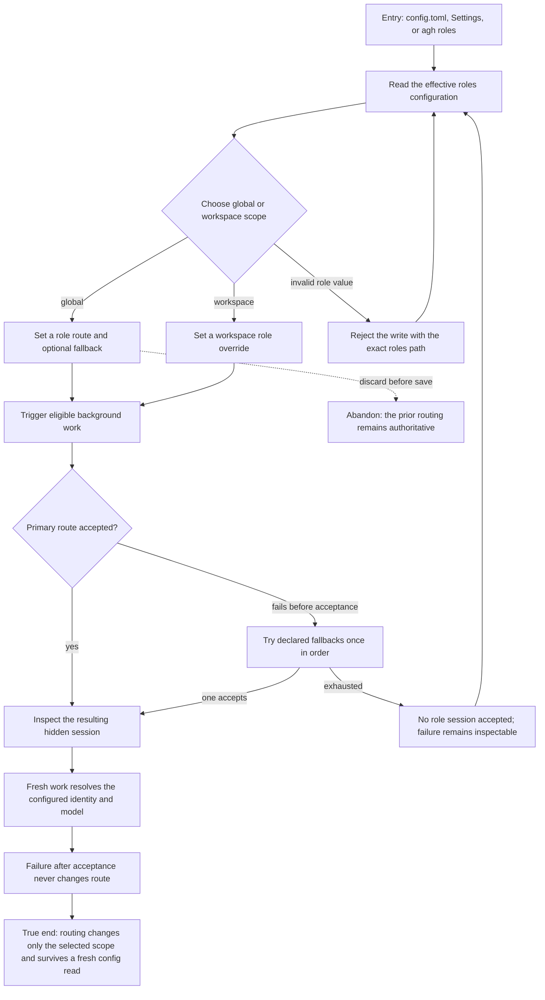

# J-route-background-work — Route background work deliberately

An operator assigns the runtime identity and model used by daemon-owned background work, then confirms that global defaults and workspace overrides affect only the intended scope.



```yaml
journey:
  id: J-route-background-work
  name: "Route background work deliberately"
  value_statement: "An operator can control the runtime identity and model used by daemon-owned work without changing its policy or leaking configuration across workspaces."
  personas: [Dora, Ada]
  entry_points:
    - url: "config.toml"
      origin: direct
    - url: "agh config set roles.<role>.<key> <value> (--scope workspace --workspace <root> for overlays)"
      origin: direct
    - url: "agh__config_list|get|set|unset over exact roles.* leaves (agh__config_path for the selected scope target only)"
      origin: direct
    - url: "agh roles list|show; GET /api/roles and GET /api/roles/{role} over HTTP or UDS"
      origin: direct
    - url: "Web /settings/roles"
      origin: direct
    - url: "docs runtime/core/configuration/config-toml [roles] + runtime/api-reference/roles"
      origin: external-share
  actions:
    - step: 1
      verb: "Read the effective role routing"
      expected_observable: "All six roles expose deterministic builtin or inherited defaults and the selected scope provenance."
    - step: 2
      verb: "Change one global or workspace role, including an ordered fallback when needed"
      expected_observable: "A valid write becomes live for new work; an invalid value names the exact path and preserves the last good configuration."
    - step: 3
      verb: "Trigger eligible background work"
      expected_observable: "The resulting hidden session uses the resolved agent, provider, model, prompt, and role-specific lifecycle."
    - step: 4
      verb: "Compare another workspace and re-read configuration"
      expected_observable: "Workspace overrides stay isolated, while global routing remains authoritative elsewhere and survives a fresh read."
  goal:
    observable: "New background work uses the configured role routing with truthful provenance and workspace isolation."
    side_effects: [config-persisted, workspace-cache-invalidated, background-session-started]
  true_end_state: "After a fresh config read and a second eligible run, the selected scope still resolves the intended identity and unrelated workspaces remain unchanged."
  exit:
    natural: "The operator returns to normal work with the desired background routing active."
  abandonment:
    - at_step: 2
      how: "The operator discards the edit before saving."
      resume: "The previous routing remains authoritative and can be edited later."
    - at_step: 2
      how: "Validation rejects an invalid role value."
      resume: "The exact path identifies the correction; a valid write can be retried without replacing the last good configuration."
  crosses: [config-lifecycle, role-resolver, workspace-isolation, session-runtime]
```

Taxonomy sweep: this journey owns the functional global/workspace round trip, structured role
discovery (including the native `agh__config_*` write path and the docs pages as entry origin),
pre-acceptance fallback, invalid-value recovery, fresh-read continuity, cross-workspace
isolation, and the Settings Roles surface. Responsive and accessibility checks belong to the
Settings-panel scenario rather than being duplicated by the transport scenarios.
