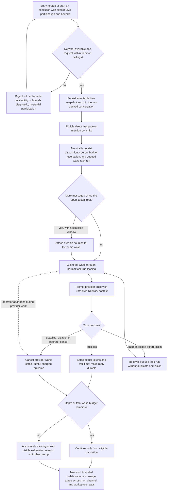

# Run bounded Live collaboration

An autonomous agent explicitly opts one execution into Live participation, receives a durable peer message, performs bounded provider work, and returns to a truthful terminal or accumulate-only state. The value is controlled collaboration: Local remains free of Network activation, while Live work is durable, workspace-isolated, usage-accounted, cancelable, and recoverable after restart.



```yaml
journey:
  id: J-run-bounded-live-collaboration
  name: "Run bounded Live collaboration"
  value_statement: "An agent can collaborate intentionally without hidden activation, runaway ping-pong, lost messages, or unaccounted provider work."
  personas: [Ada]
  entry_points:
    - url: "HTTP/UDS/CLI/native execution create or start with network_participation.mode=live"
      origin: direct
    - url: "Network direct or thread send surfaces"
      origin: external-share
  actions:
    - step: 1
      verb: "Start one execution with explicit Live participation and bounded usage"
      expected_observable: "The immutable owner snapshot is Live with its source, channel, and validated bounds; unavailable or over-ceiling requests fail without partial state"
    - step: 2
      verb: "Send eligible peer messages, including a burst on one causal root"
      expected_observable: "Every message is durable; the burst coalesces into one open wake, while ineligible or over-depth messages accumulate without prompting"
    - step: 3
      verb: "Observe the provider turn and its terminal accounting"
      expected_observable: "The target is prompted once with untrusted Network context; success, error, deadline, disable, and cancel outcomes settle truthfully with actual or explicitly unavailable usage"
    - step: 4
      verb: "Restart before claim or exhaust the configured budget"
      expected_observable: "A queued wake recovers through task-run leasing without duplicate admission; exhausted participation records a visible reason and performs no more provider work"
  goal:
    observable: "Conversation history, wake detail, task-run state, and usage totals agree after success, cancellation, exhaustion, or restart, with no wake beyond the configured bounds"
    side_effects: [network-message-persisted, task-run-wake-claimed, provider-prompted, wake-ledger-settled, usage-attributed]
  true_end_state: "A fresh read shows each message once, every admitted wake terminal and charged once, usage equal at detail and aggregate scopes, and subsequent over-budget messages durable but accumulate-only."
  exit:
    natural: "The agent continues local execution with the bounded collaboration recorded, or remains accumulate-only until a future execution opts in again."
  abandonment:
    - at_step: 3
      how: "The operator disables Network or leaves while provider work is active."
      resume: "The provider cancel is propagated, the wake settles as canceled or deadline-exceeded with truthful charging, and re-enable does not re-admit the same sources."
  crosses: [participation-resolution, network-acceptance, task-run-leases, provider-cancellation, usage-ledger, workspace-isolation, restart-recovery]
```
