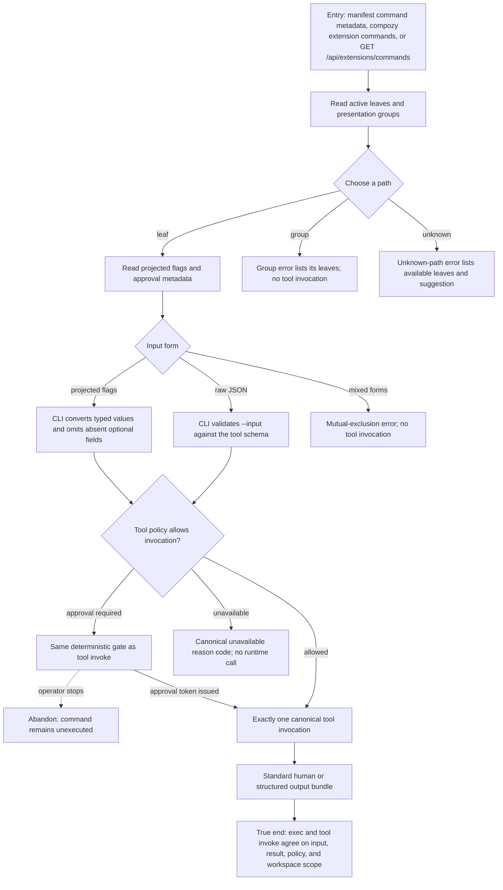

# J-run-extension-commands — Discover and run extension-contributed commands

An operator or autonomous agent discovers an active extension's command tree, supplies either the
projected typed flags or a raw JSON input document, and receives the canonical tool result without
gaining a second execution path around tool policy.



```yaml
journey:
  id: J-run-extension-commands
  name: Discover and run extension-contributed commands
  value_statement: "I can use an extension's task-focused CLI without learning its tool id, while every existing tool policy still applies."
  personas: [Bruno, Ada]
  entry_points:
    - url: generated extension.toml resources.command_groups and resources.tools.command metadata
      origin: direct
    - url: "compozy extension commands"
      origin: direct
    - url: "compozy extension exec <extension> --cmd <path>"
      origin: direct
    - url: "GET /api/extensions/commands"
      origin: direct
  actions:
    - step: 1
      verb: Build and discover the active command tree
      expected_observable: Invalid paths, groups, reserved flags, or schema projections fail the build; valid human output presents groups and leaves while structured output returns the same workspace-filtered descriptors with projected flags and approval metadata
    - step: 2
      verb: Select a leaf and supply projected flags or raw JSON
      expected_observable: Typed projected flags create the declared top-level input fields, while --input validates the complete document and cannot be mixed with projected flags
    - step: 3
      verb: Attempt a group, unknown path, unavailable command, or approval-gated command
      expected_observable: The CLI fails before execution for non-leaves and input errors, and otherwise returns the same canonical policy reason as tool invoke
    - step: 4
      verb: Approve when required and run the leaf
      expected_observable: Exactly one canonical tool invocation returns through the standard output bundle with workspace, session, and agent scope preserved
  goal:
    observable: Discovery and execution are a deterministic presentation layer over the existing tool runtime
    side_effects: [canonical-tool-invocation]
  true_end_state: A fresh discovery read still exposes only active commands, and extension exec agrees with tool invoke on input, output, approval, availability, and workspace scope
  exit:
    natural: The operator or agent continues with the command result in the selected output format
  abandonment:
    - at_step: 3
      how: Stop after an approval-required response
      resume: Discover the same command, obtain a tool approval token, and execute without changing the input contract
  crosses: [extension-sdk, manifest-build, extension-manager, tool-registry, CLI, HTTP, UDS, workspace-isolation]
```

## Coverage notes

- Journeys and functional checks: discovery through one canonical invocation is covered by the tree,
  projected-flags, and raw-input scenarios.
- Experiential checks: deterministic leaf suggestions and standard output rendering keep the CLI
  recoverable in human and structured modes.
- Edge/error/empty checks: group selection, mixed input forms, approval refusal, and backend
  unavailability are explicit branches.
- Cross-cutting checks: HTTP/UDS parity and workspace scope ride the discovery and approval scenarios.
- Safety Invariants 16-17 and ADR-008 are the explicit regression owners: presentation metadata never
  becomes execution authority, and malformed command trees fail at build and manifest load.
- Deliberate skip: responsive/mobile coverage is not applicable to this CLI/API-only surface; Task 06
  deliberately adds no Web UI.
