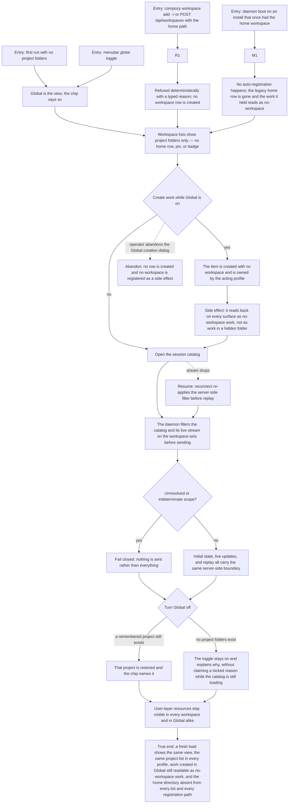

# J-scope-global-across-workspaces — Work across every project folder, and never inside my home folder

An operator starts without pointing at a project, or steps back from one, and works across every
project folder at once. "Global" means exactly that view — not a pretend workspace, and never the
home directory. Work created there simply has no workspace, and the session catalog decides what to
show on the server rather than filtering after the fact in the browser.



```yaml
journey:
  id: J-scope-global-across-workspaces
  name: "Work across every project folder, and never inside my home folder"
  value_statement: "I can start and keep working before I have a project folder, see everything across the folders I do have, and trust that my home directory is a place for shared resources rather than a workspace I can accidentally register."
  personas: [Lea, Bruno, Dora]
  entry_points:
    - url: "Web first run with zero folders, and the menubar globe toggle"
      origin: in-app-nav
    - url: "Web workspace menu, workspaces overview, palette workspace rows, Add workspace dialog"
      origin: in-app-nav
    - url: "CLI: compozy workspace add|list, compozy session list"
      origin: direct
    - url: "HTTP and UDS: POST /api/workspaces, GET /api/workspaces, /api/sessions and /api/sessions/catalog-stream"
      origin: direct
    - url: "Daemon boot on an install that previously carried the home workspace row"
      origin: direct
  actions:
    - step: 1
      verb: "Finish first run without adding a project folder"
      expected_observable: "The operator lands on a working desktop in the Global view, with no full-page workspace gate and no home-directory resolution behind the scenes."
    - step: 2
      verb: "Look at every list that can show a workspace"
      expected_observable: "Only project folders appear — the home directory is never a row, a pin, or a badge — and the list is identical in every profile."
    - step: 3
      verb: "Try to register the home directory"
      expected_observable: "It is refused deterministically with a typed reason from CLI, HTTP, and UDS alike, and no workspace row is created."
    - step: 4
      verb: "Boot a daemon that previously auto-registered the home directory"
      expected_observable: "No auto-registration happens, the legacy row is gone, and the work it used to hold reads back as no-workspace work rather than disappearing."
    - step: 5
      verb: "Create work while Global is on"
      expected_observable: "The item has no workspace, is owned by the acting profile, and reads back that way on every surface."
    - step: 6
      verb: "Watch the session catalog and its live stream"
      expected_observable: "The daemon applies the workspace boundary before sending, in initial state, live updates, and replay; an indeterminate scope sends nothing rather than everything."
    - step: 7
      verb: "Turn Global off"
      expected_observable: "A remembered project is restored and named on the chip; with no project folders the toggle stays on and states the honest reason, and never claims a locked reason while the catalog is still loading."
  goal:
    observable: "Global is a view across the registered project folders, not a workspace; the home directory is unregistrable everywhere; and catalog scoping happens on the server."
    side_effects: [no-workspace-work-created, home-registration-refused, legacy-home-row-removed-with-its-work-preserved, catalog-stream-filtered-server-side]
  true_end_state: "A fresh load shows the same view and the same project list in every profile, work created under Global is still readable as no-workspace work, and no surface or registration path can produce a home-directory workspace."
  exit:
    natural: "The operator keeps working across folders, or scopes down to one project and keeps that choice remembered."
  abandonment:
    - at_step: 5
      how: "The operator closes a creation dialog opened while Global was on."
      resume: "No row is created and no workspace is registered as a side effect."
    - at_step: 6
      how: "The catalog stream drops mid-session."
      resume: "Reconnect re-applies the server-side filter before replaying, so no out-of-scope frame arrives in the gap."
    - at_step: 1
      how: "The operator abandons first run before finishing."
      resume: "Returning starts in the Global view again; no home workspace was created while they were away."
  crosses: [J-operate-profiles, J-scope-work-by-profile, J-operate-workspace-context, J-operate-desktop-shell, daemon-boot, workspace-registry, session-catalog-stream, clientstate, Web menubar, CLI, HTTP, UDS]
```
