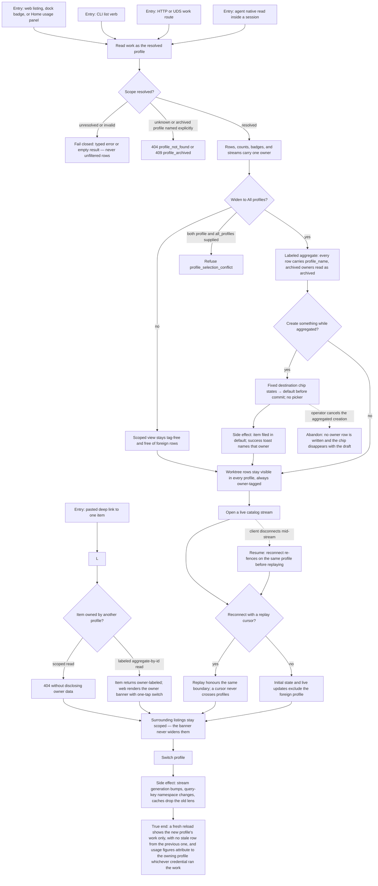

# J-scope-work-by-profile — See only this context's work, and say whose it is when I look wider

An operator works inside one profile and every listing, badge, live stream, and detail read shows
only that profile's work. When they deliberately widen to "All profiles", every row names its owner,
creation states its destination before it commits, and a link into another profile's item explains
itself instead of pretending the item does not exist. There is no third reading mode and no silent
widening.



```yaml
journey:
  id: J-scope-work-by-profile
  name: "See only this context's work, and say whose it is when I look wider"
  value_statement: "My listings show my current context and nothing else, and when I deliberately look at everything, every row tells me who owns it."
  personas: [Ada, Cora, Bruno]
  entry_points:
    - url: "Web Sessions, Tasks, Loop runs, Automations, Worktrees listings, dock badges, Home usage panel"
      origin: in-app-nav
    - url: "Deep link to /session/{id} or another item owned by a different profile"
      origin: external-share
    - url: "CLI: compozy session|task|automation|bridge|network list, with --profile and --all-profiles"
      origin: direct
    - url: "HTTP and UDS: work routes with profile= / all_profiles=true, and /api/sessions/catalog-stream"
      origin: direct
    - url: "Native tools inside a managed session (scope derived from session identity)"
      origin: agent
  actions:
    - step: 1
      verb: "List work without naming a profile"
      expected_observable: "Only the resolved profile's rows appear; an unresolved or invalid scope yields a typed error or an empty result, never unfiltered rows."
    - step: 2
      verb: "Ask for every profile at once"
      expected_observable: "Every row carries profile_name, archived owners read as archived rather than merely dimmer, and asking for one profile and all profiles together is refused."
    - step: 3
      verb: "Create work while looking at everything"
      expected_observable: "A fixed text destination chip states default before commit, the item is filed there, and the success toast names that owner."
    - step: 4
      verb: "Open a live catalog stream and reconnect"
      expected_observable: "Initial state, live updates, and replay all respect the same boundary; aggregate frames carry the owner on every row."
    - step: 5
      verb: "Follow a deep link into another profile's item"
      expected_observable: "The scoped read returns not found without leaking owner data; the aggregate-by-id read returns it owner-labeled and the web shows a banner with a one-tap switch while the surrounding lists stay scoped."
    - step: 6
      verb: "Switch profile with lists open"
      expected_observable: "Streams and query namespaces re-fence, no stale row from the previous profile survives a reload, and empty listings name the profile they are empty for."
    - step: 7
      verb: "Read usage and spend"
      expected_observable: "Figures attribute to the owning profile regardless of which credential executed the work, and the aggregate adds a per-profile breakdown including archived owners and pre-profile history under default."
  goal:
    observable: "Exactly two reading modes exist — one profile, or an explicitly labeled aggregate — and both agree across CLI, HTTP, UDS, native tools, streams, and Web."
    side_effects: [work-row-stamped-with-owner, stream-generation-bumped, list-cursor-fingerprinted-with-the-profile-predicate, query-cache-namespaced, owner-toast-emitted]
  true_end_state: "After a switch and a fresh load, every listing, badge, counter, stream, and usage figure reflects only the new profile, the aggregate still labels every owner, and no cursor, cache, or replay carries a row across the boundary."
  exit:
    natural: "The operator continues working inside the profile whose rows they can now trust are the only ones shown."
  abandonment:
    - at_step: 3
      how: "The operator closes an aggregated creation surface before committing."
      resume: "No owner row is written; the chip disappears with the draft and the next open re-reads the acting profile from the server."
    - at_step: 4
      how: "The browser or CLI loses the stream mid-session."
      resume: "Reconnect re-establishes the profile fence before replaying, so no foreign frame arrives in the gap."
    - at_step: 5
      how: "The operator declines the owner banner's switch and closes the tab."
      resume: "Nothing changed: the remembered choice still points at the profile they were in."
  crosses: [J-operate-profiles, J-command-profiles-from-palette, J-restore-per-profile-state, store-read-scope, session-catalog-stream, list-cursors, observe-and-usage, worktrees, network, bridges, notifications, Web query caches]
```
