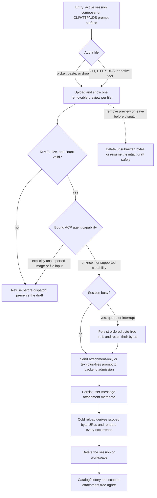

# J-session-attachments — Attach files to a session prompt

An operator can add supported files from the web or an agent-facing command, submit them alone or
with text, and trust the same scoped reference through queueing, reload, and deletion.



```yaml
journey:
  id: J-session-attachments
  name: "Attach files to a session prompt"
  value_statement: "I can attach files once and trust their scope, order, retention, and cleanup across every session surface."
  personas: [Théo]
  entry_points:
    - url: "web active session composer"
      origin: in-app-nav
    - url: "CLI, HTTP, UDS, or compozy__session_prompt"
      origin: agent-facing
  actions:
    - step: 1
      verb: "Add one or more files by picker, paste, drop, upload command, or native prompt"
      expected_observable: "Supported bytes receive ordered workspace/session-scoped refs; the web shows truthful removable previews."
    - step: 2
      verb: "Exercise MIME, size, count, image, and PDF capability branches"
      expected_observable: "Invalid input is refused before dispatch without losing the draft; unknown capability reaches backend admission, explicit bound-agent refusal blocks the matching input, and Markdown and plain text retain their text-block fallback."
    - step: 3
      verb: "Submit an attachment-only and a text-plus-attachment prompt, including while busy"
      expected_observable: "Direct, queue, and interrupt preserve ordered byte-free refs; steer never drops or accepts attachments."
    - step: 4
      verb: "Reload the session and read the persisted attachment"
      expected_observable: "The transcript derives authorized scoped byte URLs from durable metadata and renders every attachment occurrence."
    - step: 5
      verb: "Delete the session or unregister its workspace"
      expected_observable: "Successful deletion removes only the owned attachment tree; rollback restores it and excludes concurrent uploads."
  goal:
    observable: "Attachment refs and bytes remain usable for exactly their admitted session lifecycle."
    side_effects: [attachment-uploaded, prompt-ref-persisted, queued-ref-retained, scoped-bytes-served, attachment-tree-deleted]
  true_end_state: "A reload shows the sent files, pending queue entries still dispatch after retention runs, and successful deletion leaves no scoped attachment bytes."
  exit:
    natural: "The operator continues the session with a durable attachment-bearing transcript."
  abandonment:
    - at_step: 1
      how: "Remove a preview while its upload is still settling."
      resume: "The upload is deleted after settlement, or a failed delete keeps a retryable tile and durable ref."
    - at_step: 3
      how: "Leave while an attachment-bearing prompt is queued."
      resume: "The durable queue pins its refs through restart and later dispatches them in order."
  crosses: [session-composer, attachment-store, prompt-admission, busy-input-queue, transcript, session-delete, workspace-isolation]

e2e_backbone:
  web:
    - "Browser walk: picker/paste/drop → preview → direct and busy submission → cold reload → scoped file read."
  runtime:
    - "CLI/HTTP/UDS/native upload and prompt parity, durable queue retention, and deletion rollback."
  manual:
    - "Verify image and PDF capability admission against the bound ACP agent separately from Markdown/plain-text fallback."
```
