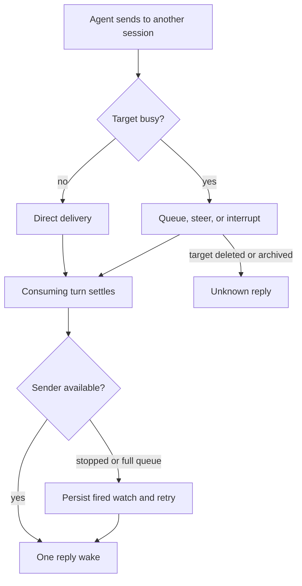

# J-session-collaboration — Send a session message and receive its reply

An agent asks another session for help, keeps the sender attribution through every delivery mode,
and receives one durable reply from the turn that handled its message.



```yaml
journey:
  id: J-session-collaboration
  name: "Send a session message and receive its reply"
  value_statement: "I can ask another agent for help and receive its answer once, with truthful attribution and delivery status."
  personas: [Dora]
  entry_points:
    - url: "native compozy__session_prompt"
      origin: in-app-nav
    - url: "Web session transcript and input queue"
      origin: in-app-nav
  actions:
    - step: 1
      verb: "Send from session A to B with notify_on_complete"
      expected_observable: "The result identifies the message and reply watch; B sees A as the sender."
    - step: 2
      verb: "Exercise direct, queued, steer, and interrupt delivery"
      expected_observable: "Origin survives admission and consumption; sent-card delivery reflects the actual result."
    - step: 3
      verb: "Settle the consuming turn"
      expected_observable: "A receives one bounded reply with the consuming turn's outcome and answer."
    - step: 4
      verb: "Repeat across failed sends, sender resume, and daemon restart"
      expected_observable: "Same-key retries preserve watch identity; deferred delivery and recovery do not duplicate replies."
  goal:
    observable: "A reads one reply and the target's history retains the attributed input."
    side_effects: [prompt-admission, attributed-input, reply-watch, reply-wake]
  true_end_state: "One reply is visible to A; delivered watches leave waiting status; status and transcript agree on delivery."
  exit:
    natural: "The requesting agent consumes the reply and continues its task."
  abandonment:
    - at_step: 3
      how: "The sender stops before the target settles."
      resume: "Resume the sender; its persisted fired watch delivers once."
    - at_step: 2
      how: "The target is deleted or archived before consuming the input."
      resume: "The sender receives unknown and can inspect history before deciding whether to retry."
  crosses: [native-tool-registry, prompt-admission, input-queue, transcript, reply-watch-store, workspace-isolation]

design_reference:
  screens: [VC-01, VC-02, VC-03, VC-04]
  design_note: "Agent collaboration boards under docs/design/opendesign/agent-collaboration/."
  truthful_ui_checks:
    - "Attribution comes from stored origin, never authored message text."
    - "The sent card uses actual delivery; the reply card reads the typed reply summary."

e2e_backbone:
  runtime: [RT-session-message-origin, RT-session-message-reply]
  integration:
    - "TestSessionMessageOriginDaemonIntegration and TestSessionMessageOriginResponseBeforeReceiptIntegration"
    - "TestReplyWatchDaemonIntegration, TestReplyWatchNativeIntegration, and TestReplyWatchCrashIntegration"
  followups:
    - "ET-web-session-message-card and real-provider walkthroughs belong to integrated QA."
```

Automated backend evidence belongs to the session reply/origin, global queue/admission, transcript,
and daemon integration suites. Web and real-provider execution remains part of the integrated QA
run; this journey does not claim that run is complete.
