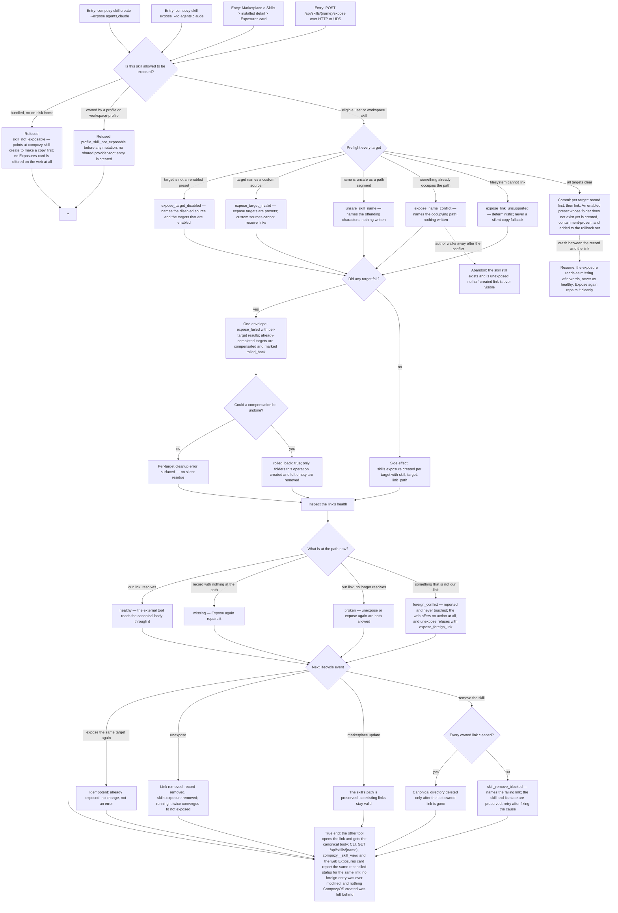

# J-share-skills-with-other-tools — Let my other tools read a skill I keep in Compozy

A skill author keeps one canonical copy in Compozy and wants Claude Code or an `agents`-convention
tool to read it too. CompozyOS puts a link in that tool's folder — never a copy — and stays honest
about that link forever: it repairs the ones it made, refuses to touch anything it did not make,
rolls back cleanly when one target of a multi-target request fails, and will not delete a skill
while one of its own links is still stuck.



```yaml
journey:
  id: J-share-skills-with-other-tools
  name: "Let my other tools read a skill I keep in Compozy"
  value_statement: "One canonical skill lives with Compozy and other tools read it through a link Compozy maintains honestly — repairing what it made, never touching what it didn't, and never rotting."
  personas: [Dora, Bruno, Ada]
  entry_points:
    - url: "CLI: compozy skill create <name> --expose <targets>, compozy skill expose <name> --to <targets>, compozy skill unexpose <name> --to <targets>"
      origin: direct
    - url: "CLI: compozy skill info <name>, compozy skill where <name>"
      origin: direct
    - url: "Web: /marketplace/skills, /marketplace/skills/$entryId — installed detail Exposures card"
      origin: in-app-nav
    - url: "HTTP and UDS: POST /api/skills/{name}/expose, POST /api/skills/{name}/unexpose, GET /api/skills/{name}"
      origin: direct
    - url: "Native: compozy__skill_view exposures[]"
      origin: agent
  actions:
    - step: 1
      verb: "Create a skill and expose it to another tool's folder in one step"
      expected_observable: "The canonical skill exists in the Compozy folder, a link exists at the target path, and the external tool resolves that link to the canonical content."
    - step: 2
      verb: "Try to expose something that is not allowed to be exposed"
      expected_observable: "A bundled skill is refused with the copy-first guidance and shows no exposure affordance on the web at all; a profile-owned skill is refused before any mutation and creates no shared entry."
    - step: 3
      verb: "Expose to two targets where one path is already occupied"
      expected_observable: "One expose_failed envelope naming both targets, the failing target carrying its own code, the completed target marked rolled back, and only folders this operation created and left empty removed."
    - step: 4
      verb: "Damage a link outside CompozyOS and look at it again"
      expected_observable: "A deleted link reads missing with repair actions; an unresolvable link of ours reads broken with repair actions; a foreign entry reads as a conflict with no action offered anywhere."
    - step: 5
      verb: "Repeat expose and unexpose on the same target"
      expected_observable: "Repeating either converges without error — expose is idempotent, unexpose runs twice to the same not-exposed end state."
    - step: 6
      verb: "Update and then remove the skill"
      expected_observable: "Update preserves the path so links stay valid; removal deletes the canonical directory only after every owned link is cleaned, and an uncleanable link blocks removal with a retryable named error instead of leaving residue."
  goal:
    observable: "Another tool reads the canonical skill body through a link CompozyOS created, and every inspection surface reports that link's true reconciled state."
    side_effects: [skill-exposure-record-written, symlink-created-in-target-root, preset-root-directory-created, skills-exposure-created-event, skills-exposure-removed-event, skills-exposure-operation-failed-event, skills-exposure-broken-detected-event, skills-exposure-cleanup-failed-event]
  true_end_state: "The external tool opens the link and gets the canonical body; the CLI, GET /api/skills/{name}, compozy__skill_view, and the web Exposures card all report the same reconciled status for the same link; no entry CompozyOS did not create was modified; and no directory or record CompozyOS created was left behind after a failure."
  exit:
    natural: "The author keeps editing one canonical skill and the other tool keeps seeing the current version."
  abandonment:
    - at_step: 1
      how: "The process is interrupted between writing the ownership record and creating the link."
      resume: "The exposure reads as missing afterwards, never as healthy; Expose again repairs it cleanly."
    - at_step: 3
      how: "The author hits a name conflict and gives up on exposing."
      resume: "The skill still exists and is simply not exposed; no half-created link is ever visible and nothing must be cleaned by hand."
    - at_step: 6
      how: "Removal is blocked by a link the operator cannot clean right now."
      resume: "The skill and its remaining state are preserved; re-running removal after fixing the cause completes cleanup."
  crosses: [J-absorb-skills-from-other-tools, J-diagnose-skill-sources, J-marketplace-acquisition, skill-exposures-store, expose-manager, filesystem-containment, CLI, HTTP, UDS, Web marketplace detail, native-tools]
```
