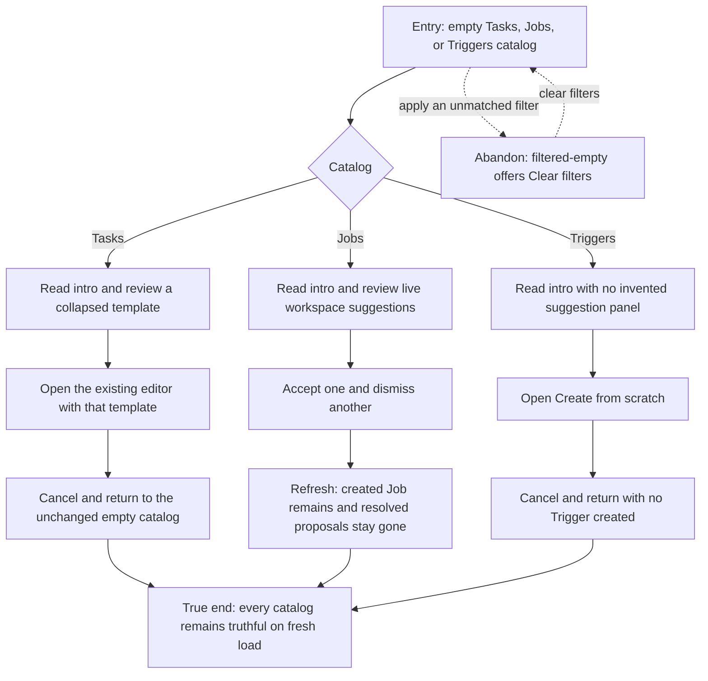

# J-start-from-empty-catalogs — Start real work from zero inventory

A workspace with no Tasks, Jobs, or Triggers should teach each object, expose
only real next actions, and remain truthful after an action or cancellation.



```yaml
journey:
  id: J-start-from-empty-catalogs
  name: "Start real work from zero inventory"
  value_statement: "An operator can understand an empty catalog and reach a real next action without sample data or unsupported controls."
  personas: [Bruno, Cora]
  entry_points:
    - url: "web /tasks, /jobs, /triggers"
      origin: in-app-nav
  actions:
    - step: 1
      verb: "Open each empty catalog from normal navigation"
      expected_observable: "The intro names the object and one real next action; Jobs alone may show live workspace suggestions"
    - step: 2
      verb: "Review a Task template and a Job suggestion"
      expected_observable: "Details disclose on demand and actions remain outside the disclosure control"
    - step: 3
      verb: "Open the Task and Trigger create flows and resolve Job suggestions"
      expected_observable: "Existing editors open; one Job is created, one proposal is dismissed, and no UI-only record appears"
    - step: 4
      verb: "Refresh and revisit filtered-empty states"
      expected_observable: "Server-owned changes persist, cancellations leave no residue, and Clear filters restores the unfiltered state"
  goal:
    observable: "Fresh loads agree with the actions taken and never present unsupported suggestions"
    side_effects: [automation-job-created, automation-suggestion-dismissed]
  true_end_state: "A refresh shows the accepted Job, keeps the dismissed proposal gone, and leaves cancelled Task and Trigger drafts unpersisted."
  exit:
    natural: "The operator can continue from the created Job or choose a Task or Trigger creation path."
  abandonment:
    - at_step: 1
      how: "The operator applies a filter that matches nothing."
      resume: "Clear filters returns to the truthful zero-inventory introduction."
  crosses: [tasks, automation-jobs, automation-triggers, workspace-scope, empty-state-ui]
```
