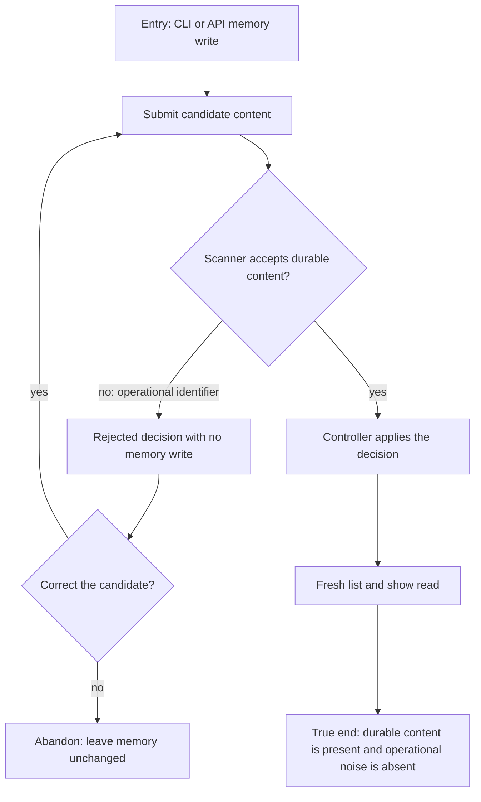

# J-store-durable-memory-safely — Store durable memory without operational noise

An agent or operator submits durable knowledge through a structured memory surface, receives a truthful controller decision, and confirms from a fresh read that only durable content changed the memory store.



```yaml
journey:
  id: J-store-durable-memory-safely
  name: "Store durable memory without operational noise"
  value_statement: "Structured memory writes preserve durable knowledge while rejecting runtime chatter before it reaches storage."
  personas: [Ada, Dora]
  entry_points:
    - url: "compozy memory write -o json"
      origin: direct
    - url: "POST /api/memory"
      origin: direct
  actions:
    - step: 1
      verb: "Submit a candidate containing a Memory v2 operational identifier"
      expected_observable: "The controller rejects it and a fresh list shows no new file."
    - step: 2
      verb: "Submit nearby durable content without operational state"
      expected_observable: "The controller applies it and returns a target filename."
    - step: 3
      verb: "Read the target from a fresh list and show request"
      expected_observable: "The stored body matches the durable candidate and contains no rejected operational chatter."
  goal:
    observable: "Unsafe operational state is rejected while a safe adjacent write persists normally."
    side_effects: [controller-decision-recorded, memory-file-written-only-for-safe-content]
  true_end_state: "Fresh CLI/API reads agree that the rejected candidate changed nothing and the safe candidate is durable."
  exit:
    natural: "The agent or operator continues work with a clean durable memory store."
  abandonment:
    - at_step: 1
      how: "The caller declines to correct the rejected candidate."
      resume: "A later write starts from the unchanged store and receives a new controller decision."
  crosses: [memory-controller, deterministic-scanner, cli, http, uds, memory-store]
```

Taxonomy sweep: this journey owns the functional rejection and safe-write paths, the empty side effect after rejection, fresh-read confirmation, and abandonment with unchanged state. Web presentation, mobile layout, and provider-backed autonomous extraction are outside this targeted CLI/API charter; the controller unit suite owns autonomous-origin collision identity.
