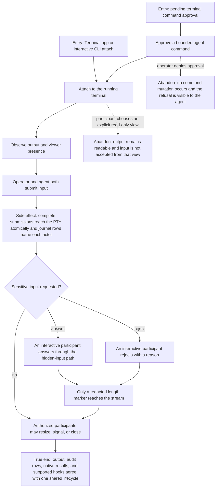

# J-supervise-agent-terminal — Work alongside an agent in a shared terminal

An operator and an authorized agent use the same terminal without negotiating ownership, while
ordinary command approvals, profile isolation, actor attribution, and sensitive-input redaction stay
truthful.



```yaml
journey:
  id: J-supervise-agent-terminal
  name: "Work alongside an agent in a shared terminal"
  value_statement: "I can intervene in agent terminal work immediately without a control handoff, while sensitive input and audit history remain safe."
  personas: [Marina, Dora]
  entry_points:
    - url: "Pending approvals, the Terminal app, and compozy terminal attach"
      origin: in-app-nav
    - url: "compozy__terminal_exec, compozy__terminal_open, compozy__terminal_write, compozy__terminal_read, compozy__terminal_wait, compozy__terminal_signal, compozy__terminal_close, compozy__terminal_list, compozy__terminal_request_input"
      origin: agent
  actions:
    - step: 1
      verb: "Approve and observe an agent command"
      expected_observable: "The approval states its command scope and every attached participant receives the same output."
    - step: 2
      verb: "Type while the agent is also active"
      expected_observable: "Both submissions are accepted immediately, remain whole at the PTY boundary, and are attributed to the actors who sent them."
    - step: 3
      verb: "Answer or reject hidden input"
      expected_observable: "Any interactive participant can settle the current request once; the answer is absent from model-visible output and the stream carries only the redacted outcome."
    - step: 4
      verb: "Resize, signal, or close from another authorized participant"
      expected_observable: "The mutation succeeds without claim, yield, takeover, or typing-grant state, and every public surface converges on the result."
  goal:
    observable: "Shared input, viewer presence, ordinary command policy, hidden input, native-tool results, and supported hooks describe one coherent terminal lifecycle."
    side_effects: [approval-consumed, input-attributed, input-redacted, terminal-hook-dispatched]
  true_end_state: "No participant owns control, all authorized participants can act, sensitive input is absent from agent-visible output, and native responses plus audit history match the final terminal state."
  exit:
    natural: "The operator detaches or closes the terminal after reviewing the shared work."
  abandonment:
    - at_step: 2
      how: "Attach through an explicit read-only presentation view instead of the interactive path."
      resume: "Reconnect interactively and write immediately without requesting control."
  crosses: [native-tools, approvals, shared-input, presence, hidden-input, hooks, terminal-stream]
```
