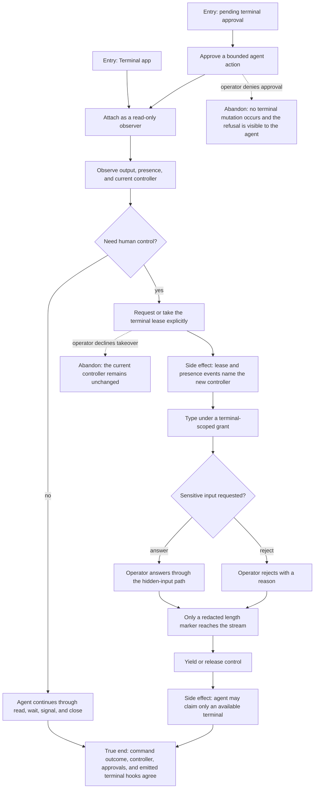

# J-supervise-agent-terminal — Watch an agent work and take control only when needed

An operator approves an agent's terminal work, watches it without interfering, transfers control
explicitly, and handles sensitive input without exposing the answer to the model or transcript.



```yaml
journey:
  id: J-supervise-agent-terminal
  name: "Watch an agent work and take control only when needed"
  value_statement: "I can supervise agent terminal work, intervene deliberately, and provide secrets without leaking them."
  personas: [Marina, Dora]
  entry_points:
    - url: "Pending approvals and the Terminal app"
      origin: in-app-nav
    - url: "compozy__terminal_exec, compozy__terminal_open, compozy__terminal_write, compozy__terminal_read, compozy__terminal_wait, compozy__terminal_signal, compozy__terminal_close, compozy__terminal_list, compozy__terminal_request_input, compozy__terminal_yield, compozy__terminal_claim"
      origin: agent
  actions:
    - step: 1
      verb: "Approve and observe an agent command"
      expected_observable: "The approval states its scope and the observer receives output without holding the write lease."
    - step: 2
      verb: "Take control and type"
      expected_observable: "Presence and lease changes identify the controller, and typing permission applies to this terminal only."
    - step: 3
      verb: "Answer or reject hidden input"
      expected_observable: "The answer is never echoed into model-visible output; the stream carries only the redacted outcome."
    - step: 4
      verb: "Yield control and let the agent continue"
      expected_observable: "The agent can claim only an available terminal and every transition emits the matching terminal hook."
  goal:
    observable: "Approval, presence, lease ownership, hidden input, native-tool results, and hook delivery describe one fenced terminal lifecycle."
    side_effects: [approval-consumed, lease-changed, input-redacted, terminal-hook-dispatched]
  true_end_state: "The terminal has one known controller, sensitive input is absent from agent-visible output, and native responses plus hook events match the final command state."
  exit:
    natural: "The operator returns the terminal to the agent or closes it after reviewing the outcome."
  abandonment:
    - at_step: 2
      how: "Decline the takeover confirmation."
      resume: "Continue watching read-only; the existing controller and typing grant remain unchanged."
  crosses: [native-tools, approvals, lease, presence, hidden-input, hooks, terminal-stream]
```
