# J-supervise-delegation-trees — Watch delegated work, drill into what went wrong, and act on it

An operator does not read transcripts to find out what their agents are doing. They open Activity,
see every delegation tree in the workspace at once, spot the one row that needs a human, drill into
that call, and either act on it — cancel, call again, message the child, publish the evidence — or
drain the whole subtree.

Two rules shape every surface here. **Counts are the daemon's**, taken from an exact-filtered read
rather than from however many rows the page happened to load — so a header count and a pager never
disagree with the runtime. And **truthful UI**: calls have no browser-reachable stream, so liveness
is a poll and the stale signal is borrowed from the session catalog stream; nothing renders a
control the runtime cannot perform, and no read or seen state appears anywhere because the runtime
does not model one.

Covers ADR-001 (the durable call record is what the UI reads), ADR-003 (parked is a distinct state
from running and from gone; revival is calling or messaging, never an invented Revive button),
ADR-005 (publish is one-way into a Network conversation and nothing flows back), ADR-011 (no
budget-exhausted state exists to render) and safety invariants 3d (subtree drain is fence-first) and
4 (the wake carries exactly the applicable payload).

```mermaid
flowchart TD
    E1[Entry: dock — Agents app, calls badge lit] --> ACT
    E2[Entry: attention bell, a needs-you call row] --> DET
    E3[Entry: web /agents/activity] --> ACT
    E4[Entry: deep link web /agents/calls/id] --> DET
    E5[Entry: session window → inspector → Calls tab] --> PANEL

    ACT[Activity: every delegation tree in the workspace]
    ACT --> GROUP[Rows grouped by governed root; indent comes from the record's own depth, never from how many ancestors the page loaded]
    GROUP --> COUNT[Per-tree counts are CallsResponse.total on a root_session_id-filtered limit=1 read — the daemon's count, not the page's]
    COUNT --> FOLD{Tree folded?}
    FOLD -->|yes| ESC[The worst state in the tree escalates onto the collapsed header — folding never hides urgency]
    FOLD -->|no| ROWS[One row per call: state, agent identity, age, cost and result stats]
    ESC --> ROWS

    ROWS --> PSTATE{Child state}
    PSTATE -->|parked| PK[Parked reads distinct from running and from gone; the affordances are call-again and message — there is no Revive control, because revival IS calling or messaging]
    PSTATE -->|running| RN[Cancel is available]
    PSTATE -->|gone| GN[Identity and state preserved; the jump link goes absent rather than 404ing]

    ROWS --> EMPTY{Any trees at all?}
    EMPTY -->|none| ES[Empty state teaches the feature rather than showing a zero]
    EMPTY -->|source stale| ST[SSE-stale: the badge contributes zero while rows stay clickable — liveness is a poll and the stale signal is borrowed from the session catalog stream]

    ROWS --> DET
    DET[Call detail /agents/calls/id]
    DET --> HDR[Header: agent, caller, child session link, state, depth, idle-TTL — suspended while running, counting while parked; a deadline appears only when one was set]
    DET --> CON[The ask, the contract digest and its collapsed schema]
    DET --> TL[State timeline: created → queued → running → settled, with the repair attempt and extraction provenance when present]
    DET --> RES{Terminal state}
    RES -->|completed, verdict returned| V1[Typed result, bounded preview plus open-full-payload]
    RES -->|completed, verdict extracted| V2[Renders as extracted — provenance is not hidden]
    RES -->|completed, verdict repaired| V3[Renders as repaired]
    RES -->|invalid-result| V4[BOTH attempts kept verbatim]
    RES -->|completed-without-result| V5[Says so plainly]
    RES -->|canceled with a late child result| V6[Superseded evidence shown without reopening the terminal]
    RES -->|failed / timeout / expired| V7[The typed reason]
    RES -->|running| V8[No result yet — nothing greyed in place of absent]

    DET --> CTRL{Controls — one per operation that actually exists}
    CTRL -->|in flight| C1[Cancel]
    CTRL -->|terminal| C2[Call again]
    CTRL --> C3[Message child — compose with typed send failures: blocked target, rate-limited, dedup-dropped, queue-cap pressure]
    C3 --> RCP[Side effect: the receipt updates in place on the sent message, queued → delivered or woke]
    CTRL -->|completed with a valid result| C4[Publish into a Network channel thread]
    C4 --> PUB[Side effect: a say with intent result, attributed to you, under Network's own rules]
    PUB --> REPLAY[Publishing the same call to the same conversation again returns the recorded id with published false — a replay, not a second post]
    PUB --> ONEWAY[Nothing ever flows back from Network into the call]

    E5 --> PANEL[Session inspector, Calls tab]
    PANEL --> DIR[Both directions — what this session asked for and what it was asked for — distinguished by arrow, not by colour alone]
    DIR --> PCOUNT[Each direction carries its own daemon count; the pager states how many of the real total are loaded]
    PANEL --> TRANS[Transcript turns]
    TRANS --> T1[The child shows the ask that started it and its bound call context]
    TRANS --> T2[Mailbox messages render with provenance stamps and delivery receipts inside an inert untrusted frame]
    TRANS --> T3[The completion wake row carries the daemon's own wake line verbatim, with the call identity and preview]
    TRANS --> T4[The caller's turn shows compozy__agent_call as a call card; a batch is ONE fan-out card]
    TRANS --> ORD[Order is the daemon's durable order — never spliced by timestamp — and no read or seen state renders anywhere]

    E2 --> BELL[Attention: needs-you rows for invalid-result, completed-without-result, and a child blocked on a decision]
    BELL --> COAL[A failing fan-out coalesces into one row per tree carrying the real count]
    BELL --> CLR[Rows clear when their cause resolves — no dismiss, no snooze, no clear-all]
    BELL --> NOBUD[No budget-exhausted row exists to render, because completions are never admission-denied]

    ROWS --> DRAIN[Stop subtree control — the same session stop with subtree the CLI invokes]
    DRAIN --> FENCE[Side effect: the root-closing fence persists BEFORE descendants are enumerated, so nothing is admitted mid-drain]
    FENCE --> REPORT[Report: stopped children, closed calls, preserved results — idempotent on repeat, resumes from the fence on boot]

    ACT -.->|operator closes the window mid-triage| AB1[Abandon: nobody is watching]
    AB1 -.->|returns later, or from another tab| ACT
    DET -.->|operator acts on a detail read that went stale| AB2[Abandon: the call settled while the panel was open]
    AB2 -.->|the daemon's terminal wins| STALE[Stale-action feedback names the real current state instead of pretending the action applied]

    REPORT --> TE
    ORD --> TE
    ONEWAY --> TE
    CLR --> TE
    TE[True end: on a fresh load after daemon restart, every count on screen equals the daemon count for the same filter, the drained subtree reports the same numbers with completed results still fetchable, the published evidence sits in the Network thread with nothing written back to the call, and every row is reachable by keyboard with its state named in words, not colour alone]
```



```yaml
journey:
  id: J-supervise-delegation-trees
  name: "Supervise delegation trees and act on what needs a human"
  value_statement: "I can see every delegation tree at once, find the one call that needs me, understand exactly what happened to it, and act — without reading a transcript or trusting a number the page invented."
  personas: [Ada, Théo]
  entry_points:
    - url: "web: /agents/activity (Activity location — delegation trees, live)"
      origin: in-app-nav
    - url: "web: /agents/calls/{call_id} (call detail location)"
      origin: deep-link
    - url: "web: session window → inspector → Calls tab; session transcript call, message and wake turns"
      origin: in-app-nav
    - url: "web: OS dock Agents badge (calls) and the attention bell needs-you and finished sections"
      origin: in-app-nav
    - url: "HTTP/UDS: GET /api/workspaces/{workspace_id}/calls?root_session_id={session_id}&limit=1; GET /api/workspaces/{workspace_id}/calls?caller={session_id}; GET /api/workspaces/{workspace_id}/calls?child_session_id={session_id}; GET /api/workspaces/{workspace_id}/calls?state=invalid-result,completed-without-result&limit=1; GET /api/workspaces/{workspace_id}/calls/{call_id}; GET /api/workspaces/{workspace_id}/calls/{call_id}/result; GET /api/workspaces/{workspace_id}/calls/{call_id}/superseded; GET /api/workspaces/{workspace_id}/messages?session={session_id}"
      origin: direct
    - url: "CLI/native parity for the same operations: compozy call list; compozy call show; compozy call cancel; compozy call publish; compozy session stop <id> --subtree; compozy__session_stop with subtree"
      origin: direct
  actions:
    - step: 1
      verb: "Open Activity with several live trees, fold one, and traverse by keyboard"
      expected_observable: "Rows group by governed root and indent by the record's own depth; a folded tree still shows its worst state on the header; the header count equals the daemon count for the same filter; every row is reachable by keyboard and every state pairs an icon with a literal word"
    - step: 2
      verb: "Open a call in each terminal state from a row and from a deep link"
      expected_observable: "Detail renders the ask, contract digest, state timeline, typed result and cost for every one of the nine states; extracted renders as extracted; invalid-result keeps both attempts verbatim; completed-without-result says so; a canceled call shows superseded evidence without reopening; a deadline appears only when one was set"
    - step: 3
      verb: "Use the controls on an in-flight call and on a terminal one"
      expected_observable: "Cancel appears only in flight, call-again and message only once terminal, and nothing is greyed in place of absent; a stale detail read that acts after the call settled reports the daemon's real current state instead of pretending the action applied"
    - step: 4
      verb: "Message a child from call detail, including a blocked, rate-limited and dedup-dropped send"
      expected_observable: "Each failure surfaces as its own typed reason; the successful send shows its receipt on the sent message and updates in place from queued to delivered or woke"
    - step: 5
      verb: "Read a session's Calls tab and its transcript"
      expected_observable: "Both directions are listed and distinguished by arrow rather than colour, each with its own daemon count while fewer rows are loaded; a pruned counterpart keeps its identity and state while the jump link goes absent; the transcript shows the ask, provenance-stamped inert message frames, the verbatim wake line, a call card for compozy__agent_call and one fan-out card for a batch, in the daemon's durable order, with no read or seen state anywhere"
    - step: 6
      verb: "Let an invalid-result, a completed-without-result and a blocked child raise attention"
      expected_observable: "Each produces a needs-you row on the Agents tile and in the bell under the existing grammar; a failing fan-out coalesces to one row per tree carrying the real count; a stale source contributes zero to the badge while its rows stay clickable; rows clear when the cause resolves and no dismiss, snooze or clear-all exists"
    - step: 7
      verb: "Publish a completed call into a Network channel thread, then publish it again"
      expected_observable: "The first publish posts bounded evidence once with source attribution; the replay returns the recorded message id with published false rather than posting twice; a different conversation publishes anew; nothing flows back from Network into the call"
    - step: 8
      verb: "Stop a three-level subtree with one completed result, then repeat the stop"
      expected_observable: "The fence persists before descendants are enumerated so nothing is admitted mid-drain; the report names stopped children, closed calls and preserved results; the repeat is idempotent; the completed result stays fetchable and the child processes are actually gone"
  goal:
    observable: "The operator found the call that needed a human, understood it, and acted on it from the surface they were already in"
    side_effects: [call-canceled, follow-up-call-created, message-sent-with-receipt, network-evidence-published, subtree-fence-persisted, descendants-stopped, open-calls-closed]
  true_end_state: "On a fresh load after a daemon restart: every count on screen equals the daemon count for the same exact filter while fewer rows are loaded; the drained subtree reports the same numbers and its completed results are still fetchable; the published evidence sits in the Network thread with nothing written back to the call; attention rows that resolved are gone without anyone dismissing them; and CLI, HTTP and the web agree on every call's state."
  exit:
    natural: "The operator returns to Activity with the needs-you row cleared."
  abandonment:
    - at_step: 3
      how: "The operator opens call detail, gets pulled away, and acts on the panel after the call has already settled."
      resume: "The durable terminal wins: the stale action reports the real current state rather than applying, and the panel re-reads the daemon's record instead of its own cached view."
    - at_step: 1
      how: "The operator closes the Agents window mid-triage."
      resume: "Nothing is attached to the window — Activity, the bell and the dock badge rebuild from the daemon's own filtered reads on return, from any tab."
  crosses: [web-agents-app, session-inspector, session-transcript, os-dock, attention-bell, session-catalog-stream, calls-http-api, network-publish-bridge, subtree-drain, CLI, native-tools]
```
