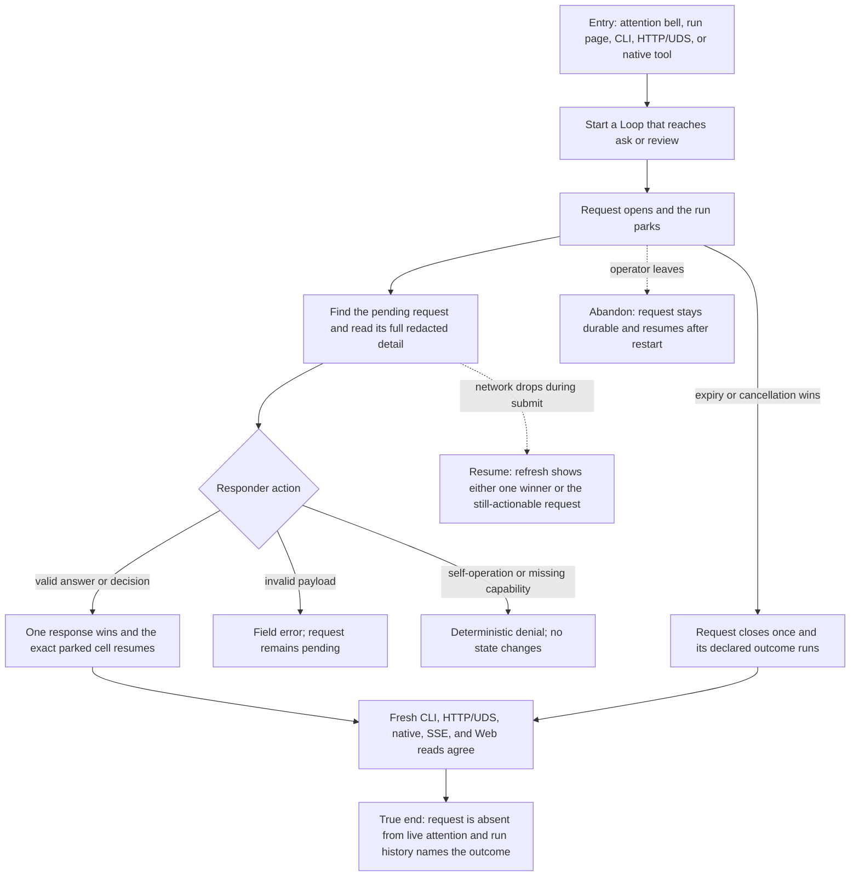

# J-supervise-loop-request — Resolve a Loop request and resume trusted work



```yaml
journey:
  id: J-supervise-loop-request
  name: "Resolve a Loop request and resume trusted work"
  value_statement: "An operator or permitted agent can find one durable human request, act once, and trust every public surface to show the same outcome."
  personas: [Bruno, Ada]
  entry_points:
    - url: "web attention bell and /loop-runs/:runId Needs-you card"
      origin: in-app-nav
    - url: "CLI: compozy loop requests|request|respond"
      origin: direct
    - url: "HTTP/UDS Loop request routes"
      origin: direct
    - url: "native tools: compozy__loop_requests|request|respond"
      origin: direct
  actions:
    - step: 1
      verb: "Open a request-bearing Loop and let it park"
      expected_observable: "The request appears once with a bounded preview and exact pending aggregate."
    - step: 2
      verb: "Read the request through a public detail surface"
      expected_observable: "The full redacted context, schema, decisions, expiry, and provenance are reachable inside the workspace."
    - step: 3
      verb: "Submit an answer or review decision"
      expected_observable: "One schema-valid response wins; invalid, duplicate, expired, canceled, unauthorized, and self responses return deterministic errors without corrupting state."
    - step: 4
      verb: "Refresh and compare every public read"
      expected_observable: "The run resumes or closes by the recorded cause, the request drains from live attention, and structured surfaces agree."
  goal:
    observable: "The exact request is resolved once and the owning run continues from the admitted payload or decision."
    side_effects: [request-ledger, coordinator-resume, attention-drain, status-and-event-updates]
  true_end_state: "A fresh browser load and independent CLI/API/native reads show the same winner, provenance, run state, and zero live count for the closed request."
  exit:
    natural: "Operator lands on the resumed run and can read the decision in history."
  abandonment:
    - at_step: 2
      how: "The operator leaves before answering."
      resume: "The request remains pending across daemon restart until answered, expired, or canceled."
    - at_step: 3
      how: "The network drops while the response is in flight."
      resume: "A fresh read reveals one committed winner or a still-actionable request; resubmission cannot execute the action twice."
  crosses: [request-store, scheduler-expiry, config-lifecycle, CLI, HTTP, UDS, native-tools, SSE, web-attention]
```

