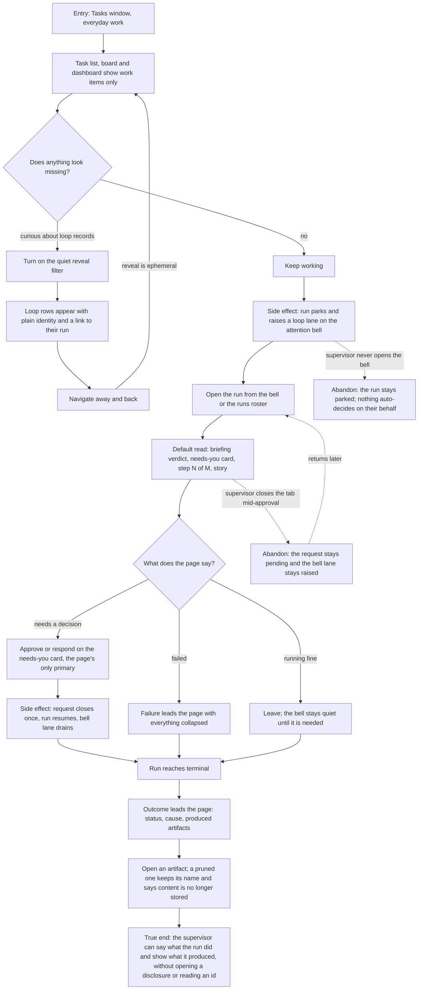

# J-supervise-loop-steady-state — Supervise a running Loop without meeting a machine id

Someone who owns delivery work keeps a Loop running in the background. Tasks keeps showing only
their own work, the attention bell tells them when a run needs a decision, and the run page answers "what is
happening, what needs me, how far along, what did it cost, what did it produce" in plain words with
every disclosure still closed. They act in place and collect the outcome when the run ends. No step
of this journey requires reading a run id, a node id, or a generation number.



```yaml
journey:
  id: J-supervise-loop-steady-state
  name: "Supervise a running Loop without meeting a machine id"
  value_statement: "A person who owns the work can keep their task list calm, be told when a run needs them, and understand and settle that run in plain language."
  personas: [Lea, Dora]
  entry_points:
    - url: "web /tasks (List, Kanban, Dashboard)"
      origin: in-app-nav
    - url: "web OS shell attention bell"
      origin: in-app-nav
    - url: "web /loop-runs"
      origin: in-app-nav
    - url: "web /loop-runs/:runId"
      origin: deep-link
  actions:
    - step: 1
      verb: "Work in Tasks while a Loop is running"
      expected_observable: "List, board, dashboard totals and inbox lanes show only work items; no coordinator or cell record appears and the counts match the visible rows"
    - step: 2
      verb: "Turn the quiet reveal filter on, then navigate away and back"
      expected_observable: "Loop records appear with a plain identity, a role tag and a working link to their run; returning to Tasks shows the reveal off again"
    - step: 3
      verb: "Answer the attention bell when it raises a loop lane"
      expected_observable: "The lane names what is waiting and opens the run that owns it"
    - step: 4
      verb: "Read the run page with every disclosure closed"
      expected_observable: "Briefing verdict and headline, the needs-you card, step N of M, and the story are all readable without expanding anything; the run id appears only in the About rail"
    - step: 5
      verb: "Act on the needs-you card"
      expected_observable: "The card owns the only primary action; the briefing offers no competing Approve/Reject and only points at the card"
    - step: 6
      verb: "Return after the run ends"
      expected_observable: "Outcome and produced artifacts lead the page; a pruned artifact keeps its name with a content-no-longer-stored note; a run that produced nothing says so plainly"
  goal:
    observable: "The run's state, the decision it needed, and what it produced are all absorbed from the default read."
    side_effects: [attention-lane-raised, request-closed-once, coordinator-resumed, attention-lane-drained, artifacts-recorded]
  true_end_state: "After a reload the supervisor can state what the run did and open what it produced, having never read a run id, node id or generation number."
  exit:
    natural: "The supervisor closes the run knowing its outcome and goes back to a task list that is still only their own work."
  abandonment:
    - at_step: 5
      how: "The supervisor closes the tab while the approval is still open."
      resume: "The request stays pending and the bell lane stays raised; nothing decides on their behalf."
    - at_step: 3
      how: "The supervisor never opens the bell."
      resume: "The run stays parked; returning later shows the same actionable request."
  crosses: [task-catalog, loop-coordinator, attention-model, briefing-projection, artifacts-retention, web-tasks, web-loops, HTTP, UDS, SSE]
```

Taxonomy note: journeys, functional and experiential dimensions are all in scope — this is the
plain-language register, so copy, reading order and "understood in under thirty seconds" are
findings, not polish. Edge/empty states in scope: the reveal-scoped empty, the true empty, the
deleted-run degrade, the pruned artifact, the no-op run. Cross-cutting: consistency of loop
vocabulary between Tasks and the run page, and the regression canary on the runs roster ordering.
Accessibility rides here as icon+text state pairing and a complete keyboard path to the needs-you
action; a dedicated Sol-lens re-walk is a recorded follow-up charter candidate, not a skip.
Responsive is deliberately out of scope for this journey — the run page and the Tasks board are
desktop surfaces, and Marina's phone lens already owns the read/approve subset elsewhere.
